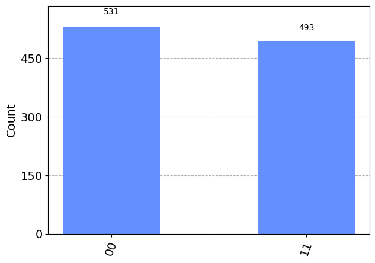

#各設問に対する解説の構成
## 問題Part
1. 問題
2. 選択肢
3. 正解選択肢 

## 解説Part

4.  用語が難しい場合はまずはその解説
5.  概要解説
6.  それぞれの選択肢解説
7.  シミューレータによる結果確認
8.  重要なqiskit API reference


# Q1 

> Which statement will create a quantum circuit with four quantum bits and four classical bits?  

[A]  
QuantumCircuit(4, 4)  

[B]  
QuantumCircuit(4)  

[C]  
QuantumCircuit(QuantumRegister(4, 'qr0')
QuantumRegister(4, 'cr1'))  

[D]  
 QuantumCircuit([4, 4])  

## 答え
[A]

## 解説
問題文は４つの量子ビットと4つの古典ビットを作るCode分を求めている。量子回路に量子ビットと古典ビットを準備する最も簡単な方法がAである。

qiskit APIには，QuantumeCircuit Classが準備されており
```
qc = QuantumCicuit(q,c)
```
と書くことで,量子ビットをq個，古典ビットをc個並べた量子回路のインスタンスを作ることができる。  
また，選択肢にはないが下記のように　量子，古典レジスタを使って回路を構成しても良い。
```
QuantumCircuit(QuantumRegister(4,"q"), ClassicalRegister(4, "c"))
```

#### 他の選択肢の解説
[B]  
因数を1つにする場合，その数の量子ビットが作られるため 4つの量子ビットを持つ回路となる。  
[C]  
名称指定されているqr0 量子ビットレジスタが4, cr1量子ビットが4つの合計8つの量子ビットが準備された回路となる。  
[D]  
数値を入力したリストは受け付けていない

## その他
### 量子, 古典レジスタの使い方
qiskit APIには，QuantumRegister, ClassicalRegister Classが用意されており，
それらのビットに任意の名前を付けたい際に便利である。


# Q2. 

> Given this code fragment, what is the probability that a measurement would result in $\ket{0}$ ?

```
qc = QuantumCircuit(1)
qc.ry(3 * math.pi/4, 0)
```

[A]  
0.8536  

[B]  
0.5  

[C]  
0.1464  

[D]  
1.0  


## 答え
[C]

## 解説
初期状態 $\ket{0}$に対して, Y軸方向に$\theta = \frac{3 \pi}{4}$回転させた場合に，$\ket{0}$が観測される確率を求める問題。

回転後の状態を$\ket{\Psi'}$とすると，Y軸方向の$\theta$回転後の状態は
$\ket{\Psi'} = \cos{\frac{\theta}{2}} \ket{0} + \sin{\frac{\theta}{2}\ket{1}}$となる。
ちなみに，上式が得られる理由は，Y軸方向の回転を操作する行列が下記で表されるためであり，
$$
\begin{align}
    R_{Y}(\theta) =
        \left(
        \begin{matrix}
        \cos{\frac{\theta}{2}} & - \sin{\frac{\theta}{2}} \\
        \sin{\frac{\theta}{2}} & \cos{\frac{\theta}{2}}
        \end{matrix}
        \right)
\end{align}
$$
この行列を$\ket{0}$に作用させると，$\ket{\Psi'}$が得られることが計算で確かめることができる。

そのため，回転後に$\ket{0}$が観測される確率
$$
\begin{align}
    P_{\ket{0}}  &= \braket{0|\Psi'}^2 \\
    &=\bra{0} \Bigl( \cos{\frac{3 \pi}{8} \ket{0}} + \sin{\frac{3 \pi}{8}} \ket{1})^2 \Bigr)\\
    &= \cos^2{\frac{3 \pi}{8}}
\end{align}
$$

このとき，倍角の公式を使って$\cos^2{\frac{3 \pi}{8}}$を計算してもいいが，それよりもざっくりとした値を把握することを優先する。個人的には一意な値を求めるより，必要なスケール感で取り得る値の範囲を把握することの方が大事だと感じている。角度$\theta$で$\cos^2{\frac{3 \pi}{8}}$を評価すればよい。

#### $\cos^2{\theta}$の評価(高校数学の復習)
$\frac{\pi}{3}<\theta = \frac{3\pi}{8} < \frac{\pi}{2}$と評価できるため，

$$
\begin{align}
\cos{\frac{\pi}{2}} & < \cos{\theta} < \cos{\frac{\pi}{3}} \\
0 & < \cos{\theta} < \frac{1}{2} \\
よって，
0 & < \cos^2{\theta} < \frac{1}{4}
\end{align}
$$

つまり，選択肢の中で0より大きく$\frac{1}{4}$より小さい値となり，答えはCとなる。

## 複数回測定した場合の測定される量子状態のヒストグラム
観測される状態のヒストグラムを作る場合は，Aer Simulator を使えばよい。  
当classでは量子状態測定のノイズフリーシミュレーションを実行できる。

回転後に測定される状態のヒストグラムは下記のようになる。

上記の通り，今回のシミュレートで回転操作後に状態$\ket{0}$を得る確率は0.1406であることがわかり，選択肢[C]が最も近い答えであることがわかる。

#### bloch simulator を使ったBloch球上のベクトル回転

bloch　simulatorを使って，Y軸方向の$\frac{3 \pi}{4}$回転した状態を描画してみる。

```python
simulator = Aer.get_backend('statevector_simulator') # statevector simulator
job = execute(qc, simulator) # run simulation
result = job.result() # get results
statevector = result.get_statevector(qc) # get state vector
plot_bloch_multivector(statevector) # plot state vector
```


# Q3. 
> Assuming the fragment below, which three code fragments would produce the circuit illustrated?
> 
```python 
  inp_reg = QuantumRegister(2, name='inp')
  ancilla = QuantumRegister(1, name='anc')
  qc = QuantumCircuit(inp_reg, ancilla)
  #Insert code here
```
[A]  
qc.h(inp_reg)  
qc.x(ancilla)  
qc.draw()  

[B]  
qc.h(inp_reg[0:2])  
qc.x(ancilla[0])  
qc.draw()  

[C]  
qc.h(inp_reg[0:1])  
qc.x(ancilla[0])  
qc.draw()  

[D]  
qc.h(inp_reg[0])  
qc.h(inp_reg[1])  
qc.x(ancilla[0])  
qc.draw()

[E]  
qc.h(inp_reg[1])  
qc.h(inp_reg[2])  
qc.x(ancilla[1])  
qc.draw()  

[F]  
qc.h(inp_reg)  
qc.h(inp_reg)  
qc.x(ancilla)  
qc.draw()  

## 答え
[A, B, D]

## 用語
ancilla : 日本語では補助の意味に相当する。量子計算の分野では，計算を進めるにあたり補助的に作用させるビットをancilla bitと呼ぶ。例えば，制御NOTでは，制御ビットの状態に応じてターゲットビットに作用させる演算が決定される。この際，ターゲットビットの状態を決めるための補助的なビットとして制御ビットが存在すると考えることができる。

##　解説
inp_regの0から1番目にq0, q1量子ビットが格納されており，ancillaの0番目にanc量子ビットが格納されている。  
与えられた画像からinp0 とinp1にアダマールゲート，anc0にNOTゲートを作用させる量子回路が与えられており，それらを実装するためのCodeを解答する必要がある。

今回この問題を解いていて初めて知ったが，リストのスライス表現で複数の量子ビットに同じ量子操作を実施できるらしいってことを知ったので勉強してみた。

[Hadamard on qiskit API ref](https://qiskit.org/documentation/stubs/qiskit.circuit.QuantumCircuit.h.html)


[A]
QuantumCircuit.h(qubit)はパラメータとして，QuantumRegisterを取る.
この時，複数のqubitを指定する場合，指定したqubit全てのアダマール変換を施す。

```python
qc.h(inp_reg)  ##複数準備された量子ビットinp_regすべてにアダマール変換を施す
qc.x(ancilla)  ## ancillaにNOT ゲートを施す
qc.draw()
```
これは題意の通りのため，正解。　　

[B]  
```python
qc.h(inp_reg[0:2]) ##inp_regの0~1番目の量子ビットにアダマール変換を施す  
qc.x(ancilla[0])   ## ancillaにNOT ゲートを施す
```
これは題意の通りのため，正解。　　


[C]  
```python
qc.h(inp_reg[0:1])  ##inp_regの0番目の量子ビットにアダマール変換を施す
qc.x(ancilla[0])   ## ancillaにNOT ゲートを施す
```
これは，inp_regの1番目の量子ビットにアダマール変換が施されないため，題意を見足さないため不正解。


[D]  
```python
qc.h(inp_reg[0])  ##inp_regの0番目の量子ビットにアダマール変換を施す
qc.h(inp_reg[1])  ##inp_regの1番目の量子ビットにアダマール変換を施す
qc.x(ancilla[0])  ##ancillaの0番目の量子ビットにアダマール変換を施す
```
これは題意の通りのため，正解。　　


[E]  
```python
qc.h(inp_reg[1])  ##inp_regの1番目の量子ビットにアダマール変換を施す
qc.h(inp_reg[2])  ##inp_regの2番目の量子ビットにアダマール変換を施す
qc.x(ancilla[1])  ##ancillaの1番目の量子ビットにアダマール変換を施す
qc.draw()
```  
inp_regは, 0と1番目の量子ビットの2つしかなく，２番目の量子ビットは存在しない。
そのため，2行目で "IndexError: list index out of range"となりエラーとなる。

[F]  
```python
qc.h(inp_reg)  ##inp_regの0~1番目の量子ビットにアダマール変換を施す  
qc.h(inp_reg)  ##inp_regの0~1番目の量子ビットにアダマール変換を施す  
qc.x(ancilla)   ##ancillaの1番目の量子ビットにアダマール変換を施す
qc.draw()  
```
0~1番目の量子ビットに2回の
アダマール変換が解かされており，題意に反する。


# Q4.
Given an empty QuantumCircuit object, qc, with three qubits and three classical bits, which one of these code fragments would create this circuit?


[A]  
qc.measure([0,1,2], [0,1,2])  

[B]  
qc.measure([0,0], [1,1], [2,2])

[C]  
qc.measure_all()  

[D]  
qc.measure(0,1,2)


## 答え
3つの量子ビットと3つの古典ビットを用意する。
量子ビット[0,1,2]をそれぞれの順番で　古典ビット[0,1,2]で測定する回路を作成する。
qc.measureはqc.cme\hat{CX} &=asure(qubit, cbit)のように，2つのパラメータを取る。
これを満たしているのは，[A]となる。

[A]  
qc.measure([0,1,2], [0,1,2])  
これは，題意を満たしており，正解。

[B]  
qc.measure([0,0], [1,1], [2,2])
3つのパラメータを取っているため，TypeErrorになる。

[C]  
qc.measure_all()  


qc.measure_all()は，新たに測定用のcbitを追加して測定結果を保存する。
また，qc.measre_all()は，測定前にBarrierを入れる仕様になっている。
与えられた回路では，古典ビットは3つのため，追加された分古典ビットが多くなるため題意に沿わない。そのため不正解。


ちなみに，qc.measure_all()はparameterで既存の古典ビットに測定を保存することができる。
その場合，qc.measure_all(add_bits=False)とする。
この場合，題意を満たすため正解となる。


[D]  
qc.measure(0,1,2)

これも[B]同様，3つのパラメータを取っているため，TypeErrorになる。


# Q5
> Which code fragment will produce a maximally entangled, or Bell, state?

[A]  
bell = QuantumCircuit(2)  
bell.h(0)  
bell.x(1)  
bell.cx(0, 1)  

[B]  
bell = QuantumCircuit(2)  
bell.cx(0, 1)  
bell.h(0)  
bell.x(1)  

[C]  
bell = QuantumCircuit(2)  
bell.h(0)  
bell.x(1)  
bell.cz(0, 1)  

[D]  
bell = QuantumCircuit(2)  
bell.h(0)  
bell.h(0)


## 答え
[A]

## 解説


## simulation
Aer Simulatorでそれぞれの測定確率をPlotしてみる。


上記の結果の通り，$\ket{q_{0}} \otimes \ket{q_{1}}$の直積状態で表されるのは, 
選択肢の[A]のみである。

ちなみに[B], [C]は$\left( \ket{1} \otimes \frac{1}{\sqrt{2}} (\ket{0} + \ket{1}) \right)$, [D]は $\left( \ket{0} \otimes \ket{0} \right)$の直積で表される。[A]は直席では表すことができず，エンタングルしていると言える。


# Q6
> Given this code, which two inserted code fragments result in the state vector represented by this Bloch sphere?
```python
  qc = QuantumCircuit(1,1)
  # Insert code fragment here
  simulator = Aer.get_backend('statevector_simulator')  
  job = execute(qc, simulator)  
  result = job.result()  
  outputstate = result.get_statevector(qc)  
  plot_bloch_multivector(outputstate)
```


[A]  
qc.h(0)  

[B]  
qc.rx(math.pi / 2, 0)  

[C]  
qc.ry(math.pi / 2, 0)  

[D]  
qc.rx(math.pi / 2, 0)  
qc.rz(-math.pi / 2, 0)  

[E]  
qc.ry(math.pi, 0)


## 答え
[A], [C]

## 解説
与えられた操作後，X軸上倒れたベクトルになっている。
初期状態は，$\ket{\Psi_{0}} = \ket{0}$であり，ブロッホ球は  

と描かれる。
この初期状態をY軸方向に$\frac{\pi}{2}$回転させる，問題文で与えられた操作後の状態ベクトルになることがわかる。これは選択肢で言うと[C]に相当する。また，初期状態$\ket{0}$をアダマール変換された状態と同等であり，選択肢[A]に相当する。

ちなみに，選択肢[C]は  
  
となる。

# Q7.

> S-gate is a Qiskit phase gate with what value of the phase parameter?

[A]  
π/4  

[B]  
π/2  

[C]  
π/8  

[D]  
π

## 答え
[B]


## Q8. 

> Which two code fragments, when inserted into the code below, will produce the statevector shown in the output?
  
```python 
from qiskit import QuantumCircuit, Aer, execute
from math import sqrt
qc = QuantumCircuit(2)  
# Insert fragment here  
simulator = Aer.get_backend('statevector_simulator')  
result = execute(qc, simulator).result()  
statevector = result.get_statevector()  
print(statevector)
```

Output:
[0.707+0.j  0.+0.j  0.+0.j  0.707+0.j]

[A]  
v = [1/sqrt(2), 0, 0, 1/sqrt(2)]  
qc.initialize(v,[0,1])

[B]  
qc.h(0)  
qc.cx(0,1)  

[C]  
v1, v2 = [1,0], [0,1]  
qc.initialize(v1,0)  
qc.initialize(v2,1)  

[D]　　
qc.cx(0,1)  
qc.measure_all()  

[E]  
qc.h(0)  
qc.h(1)  
qc.measure_all()

## 答え
[A], [B]

## 解説
何度も出てくるので覚えておいた方がいい数字が0.707。
これは$\frac{1}{\sqrt{2}}$のことです。

qc.initialize(v)では，vに複素数の振幅ベクトルを設定することができる。
例えば，

$$
v = 
\left(
    \begin{matrix}
      \frac{1}{\sqrt{2}}  \\
      0 \\
      0 \\
      \frac{1}{\sqrt{2}} \\

    \end{matrix}
\right)
$$
とすると，  
測定確率は下記のようになる。  



初期ベクトルvは，$\ket{00}$と$\ket{11}$の振幅を$\frac{1}{\sqrt{2}}$に初期化するものであるから，状態ベクトルは
$\ket{\Psi_{0}} = \frac{1}{\sqrt{2}} \left( \ket{000} + \ket{011} \right)$  
と表すことができるためである。


[A]  
これは $\ket{00}$ と$\ket{11}$の振幅を$\frac{1}{\sqrt{2}}$に設定しており，ベル状態となっている。これは，題意合致するため正解。


[B]  
これも，[A]と同様にベル状態を生成する。これも題意に合致しているため正解となる。


[C]  
この場合は，0番目のqubitは $\ket{q_{0}}=\ket{0}, \ket{q_{1}}=\ket{1}$で初期化されているため，$\ket{\Psi_{0}} = \ket{1} \otimes \ket{0} = \ket{10}$となる。  

[D]  
初期状態が$\ket{00}$ に対して，制御NOTで操作しても，状態は変わらないため，最終的な結果は$\ket{00}$となる。

[E]  
q0, q1をそれぞれアダマール変換したものがテンソル積された状態が得られる。

選択肢の[A]~[E]のそれぞれの量子状態を測定した際のヒストグラムは下記の通りになる。


# Q9. 

> Which code fragment will produce a multi-qubit gate other than a CNOT ?

[A]  
qc.cx(0,1)  

[B]  
qc.cnot(0,1)  

[C]  
qc.mct([0],1)  

[D]  
qc.cz(0,1)

## 答え  
[D]

## 解説
methodで用意されている制御NOTのParametersは　qc.cx(control, target)の順で指定する。
[A], [B]
cx, cnot　methodは同じ使い方が可能。

[C]
また複数の制御ビットを持つNOT Gateを使いたい時は.mct methodも用意されている。
第1因数としてリストを与えると，制御ビットとして用いるqubitを指定することができる。

例えば，下記のように2つの制御ビットを持つ制御NOT(toffoli) Gateを作ることもできる。
```python 
qc = QuantumCircuit(3)
qc.mct([0, 1], 2)
qc.draw()
```


制御NOTゲートは
$$

\begin{align}

\hat{CX} &= 
  \left(
      \begin{matrix}
      1 & 0 & 0 & 0 \\
      0 & 1 & 0 & 0 \\
      0 & 0 & 0 & 1 \\
      0 & 0 & 1 & 0 \\
      \end{matrix}

  \right) \\

  &= \hat{I_t} \ket{0_c} \bra{0_c} + \Bigl( \ket{0}_t \bra{1}_t + \ket{1}_t \bra{0}_t \Bigr) \ket{1}_c \bra{1}_c \\

\end{align}
$$

初期状態$\ket{{\Psi_0}}$として下記のように定義して，$\hat{CX}$を作用させると
$$
\begin{align}
  \ket{\Psi_{0}}
      &=
  \left(
    \begin{matrix}
      \alpha \\
      \beta \\
      \gamma \\
      \delta
    \end{matrix}
  \right) \\

    & = \alpha \ket{0}_t \otimes  \ket{0}_c +
    \beta \ket{0}_t \otimes \ket{1}_c + 
    \gamma \ket{1}_t \otimes \ket{0}_c + \delta \ket{1}_t \otimes \ket{1}_c \\
    & = \alpha \ket{00}+ \beta \ket{01} + \gamma \ket{10} + \delta \ket{11}\\ 
\\
\ket{\Psi'} &= \hat{CX} \ket{\Psi_0} \\
&= \alpha \ket{00}+ \beta \ket{11} + \gamma \ket{10} + \delta \ket{01}\\ 

\end{align} \\
$$

となり，$\ket{01}$と$\ket{11}$状態の振幅が入れ替わることを確認できる。


[D]
制御ZGateは，制御ビットが1, かつTargetビットが1の時，そのTarge ビットのいそうを反転させる。<br> 
そのため，X-Gateのビット反転操作にはならず，題意に反するため不正解。
制御ZGateの行列，ディラック表現は下記のようになる。
$$
\begin{align}
  \hat{CZ} &= 
  \left(
    \begin{matrix} 
    1 & 0 & 0 & 0 \\
    0 & 1 & 0 & 0 \\
    0 & 0 & 1 & 0 \\
    0 & 0 & 0 & -1 \\
    \end{matrix}
  \right)\\

  &= \hat{I}_t \ket{0}_c+ \Bigl( \ket{0}_t \bra{0}_t - \ket{1}_t \bra{1}_t \Bigr) \ket{1}_c \bra{1}_c 
\end{align}
$$

$\hat{CX}$の時と同様に，ベクトル$\ket{\Psi_{0}}$に作用させると

$$
\begin{align}
  \ket{\Psi'} &= \hat{CZ} \ket{\Psi_{0}}  \\
  &= \alpha \ket{00}+ \beta \ket{01} + \gamma \ket{10} - \delta \ket{11}\\ 

\end{align}  
$$
となり，$\ket{11}$の符合が反転(位相が$\pi$回転)することを確認できる。


# Q10
> Which code fragment will produce a multi-qubit gate other than a Toffoli?

[A]  
qc.ccx(0,1,2)  

[B]  
qc.mct([0,1], 2)  

[C]  
from qiskit.circuit.library import CXGate  
ccx = CXGate().control()  
qc.append(ccx, [0,1,2])  

[D]  
qc.cry(0,1,2)  


## 疑問

## 解説
[D]

cry
qc.cry(theta, control_bit, target_bit)の順にParameterをとる。  
選択肢[D]のように指定すると，存在しない２番目のqbitをTarget bitに指定していることからエラーとなる。  
[qc.cryのAPIリファレンス](https://qiskit.org/documentation/stubs/qiskit.circuit.QuantumCircuit.cry.html)


# Q11
> Which two options would place a barrier across all qubits to the QuantumCircuit below?

```
  qc = QuantumCircuit(3,3)
```

[A]  
qc.barrier(qc)  

[B]  
qc.barrier([0,1,2])  

[C]  
qc.barrier()  

[D]  
qc.barrier(3)  

[E]  
qc.barrier_all()  


## 答え
[B], [C]


##　解説

## API ref
[barrier](https://qiskit.org/documentation/stubs/qiskit.circuit.library.Barrier.html)

[C]


[D]  
3はindexがout of rangeとなるため　エラーとなる。


[E]  
qc.barrier_all()は使えそうだが，barrier_allというmethodはない。


# Q12 
> What code fragment codes the equivalent circuit if you remove the barrier in the following QuantumCircuit?


[A]  
qc = QuantumCircuit(1,1)  
qc.h(0)  
qc.s(0)  
qc.h(0)  
qc.measure(0,0)  

[B]  
qc = QuantumCircuit(1,1)  
qc.measure(0,0)  
[C]  
qc = QuantumCircuit(1,1)  
qc.h(0)  
qc.t(0)  
qc.tdg(0)  
qc.h(0)  
qc.measure(0,0)  

[D]  
qc = QuantumCircuit(1,1)  
qc.h(0)  
qc.z(0)  
qc.h(0)  
qc.measure(0,0)  

# Q13
> Given the following code, what is the depth of the circuit?
  ```python
  qc = QuantumCircuit(2, 2)
  qc.h(0)
  qc.barrier(0)
  qc.cx(0,1)
  qc.barrier([0,1])
  ```
[A]  
2  

[B]  
3 

[C]  
4  

[D]  
5  


# Q14
> Which code snippet would execute a circuit given these parameters?
1. Measure the circuit 1024 times,
2. use the QASM simulator,
3. use a coupling map that connects three qubits linearly

```python
qc = QuantumCircuit(3)
# Insert code fragment here
result = job.result()
```

[A]  
qasm_sim = Aer.get_backend('qasm_simulator')  
couple_map = [[0, 1], [1, 2]]  
job = execute(qc, backend=qasm_sim, shots=1024,   coupling_map=couple_map)  

[B]  
qasm_sim = Aer.getBackend('ibmq_simulator')  
couple_map = [[0, 1], [0, 2]]  
job = execute(qc, loop=1024, coupling_map=couple_map)

[C]  
qasm_sim = Aer.get_backend('qasm_simulator')   
couple_map = [[0, 1], [1, 2]]  
job = execute(qc, backend=qasm_sim, repeat=1024, coupling_map=couple_map)  

[D]  
qasm_sim = Aer.get_backend('qasm_simulator')  
couple_map = [[0, 1], [1, 2]]  
job = execute(backend=qasm_sim, qc, shot=1024, coupling_map=couple_map)  


# Q15
> Which of these would execute a circuit on a set of qubits which are coupled in a custom way?
> 
```python 
from qiskit import QuantumCircuit, execute, BasicAer  
backend = BasicAer.get_backend('qasm_simulator')
qc = QuantumCircuit(3)
    # insert code here
```

[A]  
execute(qc, backend, shots=1024, coupling_map=[[0,1], [1,2]])  

[B]  
execute(qc, backend, shots=1024, custom_topology=[[0,1],[2,3]]

[C]  
execute(qc, backend, shots=1024, device="qasm_simulator", mode="custom") 

[D]  
execute(qc, backend, mode="custom")  


#Q16 
> Which three simulators are available in BasicAer?

[A]  
qasm_simulator  

[B]  
basic_qasm_simulator  

[C]  
statevector_simulator  

[D]  
unitary_simulator  

[E]  
quantum_simulator  

[F]  
quantum_circuit_simulator  


# Q17
> Which line of code would assign a statevector simulator object to the variable backend ?

[A]  
backend = BasicAer.StatevectorSimulatorPy()  

[B]  
backend = BasicAer.get_backend('statevector_simulator') 

[C]  backend = BasicAer.StatevectorSimulatorPy().name()  

[D]   
backend = BasicAer.get_back('statevector_simulator')  


# Q18  
> Which code fragment would yield an operator that represents a single-qubit X gate?  

[A]  
op = Operator.Xop(0)  

[B]  
op = Operator([[0,1]])  

[C]  qc = QuantumCircuit(1)
qc.x(0)  
op = Operator(qc)  

[D]  
op = Operator([[1,0,0,1]])  


# Q19
> What would be the fidelity result(s) for these two operators, which differ only by global phase?  

```python 
    op_a = Operator(XGate())
    op_b = numpy.exp(1j * 0.5) * Operator(XGate())
```

[A]  
state_fidelity() of 1.0  

[B]  
state_fidelity() and average_gate_fidelity() of 1.0  

[C]  
average_gate_fidelity()andprocess_fidelity()of 1.0

[D]  
state_fidelity()  
average_gate_fidelity() and process_fidelity() of 1.0  


# Q20 
> Given this code fragment, which output fits most closely with the measurement probability distribution?

```python 
qc = QuantumCircuit(2, 2)
qc.x(0)
qc.measure([0,1], [0,1])
simulator = Aer.get_backend('qasm_simulator')
result = execute(qc, simulator, shots=1000).result()
counts = result.get_counts(qc)
print(counts)
```

[A]  
{'00': 1000}  

[B]  
{'01': 1000}  

[C]  
{'10': 1000}  

[D]  
{'11': 1000}