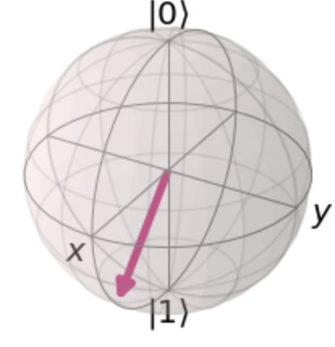
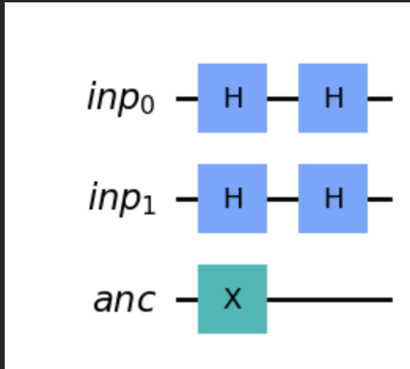
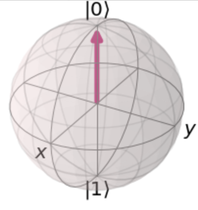
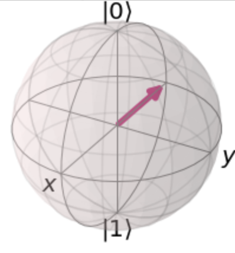
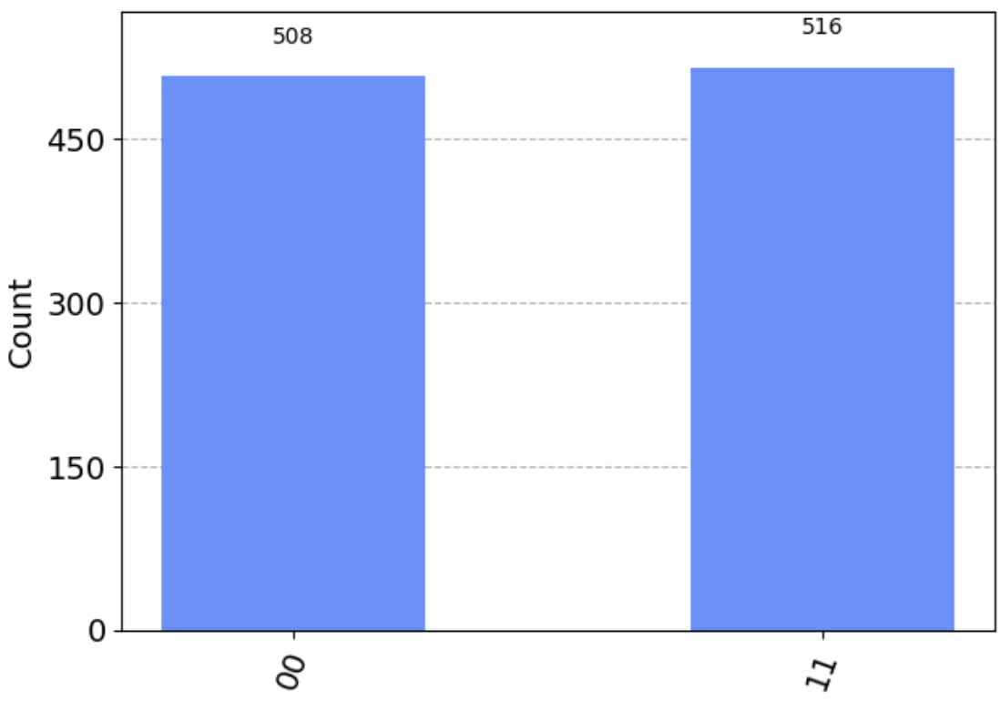

<style>
  .bg-y{
    background-color: rgb(255,255,100);
  }

  .txt-g{
    color: rgb(85,85,85);
  }
</style>


# はじめに
突然ですが，量子コンピュータに関する基礎知識を学ぶ直すことにしました！
学生の頃からも興味があり, "猿でもわかる..."のような入門書は読んできたが実装とは程遠いレベルのものでした。また，大学院では量子力学に関する講義も受けてきたし，物理学修士号を持っているため　量子力学に対してズブの素人というわけではないのですが，学生時代の研究や議論の中でも理解できていないことの方が多すぎて，"真の理解"とは遠いなという正直な気持ちもありました😂 社会人になって10年が経っても量子コンピュータへの憧れの気持ちはまだ衰えておらずその応用や社会実装される形をイメージしたい気持ちが再熱しました🔥 ということで，まずは基本的な内容を学び直すことにしました。


本音を言えば，"量子コンピュータってカッコいい。学生時代サボっちゃったから挽回したい！！！"　以上の何者でもないです😋


# なぜIBM-C1000-128??
好きで何かを学び始めても何かわかりやすい目標がないと続かないという完全無欠の3日坊主体質のため，ひとまずIBMの資格試験をとるところまでを目標にして，その後まだ好きであれば次の目標を設定することにした。

# 本解説の概要
丁寧に解説しているため，基礎を理解している方からすると冗長な内容になっています💦
数式の計算についても，行列計算とディラック計算をそれぞれ書き分けるようにしていたり。。。
大まかに理解する上で計算自体はそんなに重要ではないが，今後量子操作を実装していく予定がある方には，数式の取り扱いもできるようにしておくとよいかなと思ったのでできる限り丁寧に記載しています。ただし，深追いするよりはわからない場合は　すっ飛ばして後で戻ってくるくらいのザックリ理解が良いと思います！

## 各設問に対する解説の構成

### 問題Part
Q#. 問題
- 選択肢一覧
- 正解選択肢 

### 解説Part
Q#.1　用語ゴロゴロ
  - 用語が難しくて手が出せない場合があります。チャジれば(chatGPTに聞けば)いいですが，サクッと進むために私が簡潔に記載します！

Q#.2 背景もろもろ
  - 筆者の理解の範囲で問題の背景や関連事項を描きます！

Q#.3 選択肢それぞれ
  - 選択肢の解説です！正解だけでなく，不正解選択肢も舐め回します👅選択肢によっては「なんで不正解なの？」と思うとき，ないでしょうか？？私はめちゃくちゃあります！「なぜ不正解となるか？」を学ぶことも，正解を学ぶことと同じくらい大事だと思うので冗長にはなりますが，一生懸命書きたいと思います！時間があればサラッと目を通してください！「こう直せば，正解になるね！」まで書ければいいけど。。。さすがにしつこいかぁぁぁ😋

Q#.4 シミューレータぶんぶん
  - 手計算だけでなく，シミュレータを使った計算も残したいと思います。ただし，Code部分はgithub上に残したjupyternotebookの方を参照してください！

Q#.5 APIぞろぞろ
  - 関係するqiskit API をreferenceを記載します！

Q#.6 言い残しほいほい
- 書き忘れたことを描きます。関係あることだといいですね💩

---

それでは早速始めましょう！

## Q1 

> Which statement will create a quantum circuit with four quantum bits and four classical bits?  

<span class="bg-y txt-g">
[A]  
</span>
<br>
QuantumCircuit(4, 4)  

[B]  
QuantumCircuit(4)  

[C]  
QuantumCircuit(QuantumRegister(4, 'qr0'), QuantumRegister(4, 'cr1'))  

[D]  
 QuantumCircuit([4, 4])  

### Q1-1.用語
Registerという単語が出てきましたね。古典コンピュータでのレジスタとはなんだったでしょうか？レジスタは，データや処理を格納する場所である点でメモリと似ていますが，CPU内に存在している点が異なります。容量は限られている代わりにCPUと連携して動作できる分，高速な処理が可能です。メモリは記憶領域にあるので，大容量のデータを保存できる一方で動作は遅くなります。
これから扱う量子ビット, 古典ビットは全て回路内に存在していることを想定しているためメモリではなくレジスタという表現が正しいことですね😋

### Q1-2.背景もろもろ
 まず，量子ビットと古典ビットの両方を用意しないといけない理由はなんでしょうか？量子コンピュータでは，重ね合わせやエンタングル状態といった量子ビット特有の状態を使って計算を実行しますが，量子ビットの状態を制御したり，状態を測定したりするのは古典ピットの役割なのです！なので，古典ビットは量子計算の制御や制御フローの管理において重要な役割を果たしていると言えるのです😋  
 問題文は４つの量子ビットと4つの古典ビットを作るCode分を求めています。


### Q1-3.選択肢それぞれ

qiskit APIには，QuantumeCircuit Classが準備されており
```
qc = QuantumCicuit(q,c)
```
と書くことで,量子ビットをq個，古典ビットをc個をレジスタに格納した量子回路のインスタンスを作ることができるのです。  
また，選択肢にはないが下記のように　量子，古典レジスタを使って回路を構成しても良い。
```
QuantumCircuit(QuantumRegister(4,"q"), ClassicalRegister(4, "c"))
```

[A]
上の解説のq, cにそれぞれ4が入ったcodeとなり，4つの量子-古典ビットを有する量子回路を作ります。これは題意を満たします！

[B]  
因数を1つにする場合，その数の量子ビットが作られるため 4つの量子ビットを持つ回路となる。古典ビットを準備できていないので不正解ですね！

[C]  
名称指定されているqr0 量子ビットレジスタが4, cr1量子ビットが4つの合計8つの量子ビットが準備された回路となります。あらあらおっちょこちょいですね〜，古典ビットの代わりに量子ビットを作っています！残念ながら不正解！
```
QuantumCircuit(QuantumRegister(4,"q"), ClassicalRegister(4, "c"))
```
  
とかけば正解でした！

[D]  
選択肢のようにリストは引数として受け入れません。
リストの外に出して，
第一引数: 量子ビット数，第二因数: 古典ビット数
となるようにしましょう！

#### Q1-4. シミュレータぶんぶん
この問題はシミュレートすることないのでSkip！

#### Q1-5. APIぞろぞろ
[QutumCircuit](https://qiskit.org/documentation/stubs/qiskit.circuit.QuantumCircuit.html)  
第一引数にregistorsを取ることが説明されていますね！

---

## Q2. 

> Given this code fragment, what is the probability that a measurement would result in $\ket{0}$ ?

```
qc = QuantumCircuit(1)
qc.ry(3 * math.pi/4, 0)
```

[A]  
0.8536  

[B]  
0.5  

[C]  
0.1464  

[D]  
1.0  


## 答え
[C]

## Q2-1.用語ごろごろ
ry(3*math.pi/4,0)はQuantumCircuitクラスに用意されたY軸方向の回転操作メソッドです。ブロッホ球上の量子状態に対して，Y軸方向に$\frac{3 \pi}{4}$回転させるユニタリ操作を表します！
またややこしいですが，"Y軸方向に回転"とは，ネジの頭をY軸の負側，ネジの部分を正方向に置いたときにネジを回す向きが正方向の回転になります。Y軸の負方向に向かって反時計回りと同じです！ややこしいな！


## Q2-2.背景もろもろ
おなじみブロッホ球です。いまだにちゃんと描けません！確かに，回転操作については直感的に理解できるので重宝しますね！これをぐりぐり回せるシミュレータをUnityとかで描けるようになりたいなぁぁ(願望)

## Q2-3. 選択肢色々

初期状態 $\ket{0}$に対して, Y軸方向に$\theta = \frac{3 \pi}{4}$回転させた場合に，$\ket{0}$が観測される確率を求める問題。

回転後の状態を$\ket{\Psi'}$とすると，Y軸方向の$\theta$回転後の状態は
$\ket{\Psi'} = \cos{\frac{\theta}{2}} \ket{0} + \sin{\frac{\theta}{2}\ket{1}}$となる。
ちなみに，上式が得られる理由は，Y軸方向の回転を操作する行列が下記で表されるためであり,  
$$
\begin{align}
    R_{Y}(\theta) =
        \left(
        \begin{matrix}
        \cos{\frac{\theta}{2}} & - \sin{\frac{\theta}{2}} \\
        \sin{\frac{\theta}{2}} & \cos{\frac{\theta}{2}}
        \end{matrix}
        \right)
\end{align}
$$  
この行列を$\ket{0}$に作用させると，$\ket{\Psi'}$が得られることが計算で確かめることができる。

そのため，回転後に$\ket{0}$が観測される確率  
$$
\begin{align}
    P_{\ket{0}}  &= \braket{0|\Psi'}^2 \\
    &=\Bigl( \bra{0} (\cos{\frac{3 \pi}{8} \ket{0}} + \sin{\frac{3 \pi}{8}} \ket{1}) \Bigr)^2\\
    &= \cos^2{\frac{3 \pi}{8}} \braket{0|0} + \sin^2{\frac{3 \pi}{8}} \braket{1|0} \\
    &= \cos^2{\frac{3 \pi}{8}}
\end{align}
$$  

このとき，倍角の公式を使って$\cos^2{\frac{3 \pi}{8}}$を計算してもいいが，それよりもざっくりとした値を把握することを優先する。個人的には一意な値を求めるより，必要なスケール感で取り得る値の範囲を把握することの方が大事だと感じている。角度$\theta$ で $\cos^2{\frac{3 \pi}{8}}$ を評価すればよい。

$\frac{\pi}{3}<\theta = \frac{3\pi}{8} < \frac{\pi}{2}$と評価できるため，

$$
\begin{align}
\cos{\frac{\pi}{2}} & < \cos{\theta} < \cos{\frac{\pi}{3}} \\
0 & < \cos{\theta} < \frac{1}{2} \\
よって，
0 & < \cos^2{\theta} < \frac{1}{4}
\end{align}
$$

つまり，選択肢の中で0より大きく$\frac{1}{4}$より小さい値となり，答えはCとなります！おめでとう！半角の公式でちゃんとあたい求める人は偉い！公式忘れた！

ちなみに，今回の問題は計算結果が異なるため[C]以外の選択肢は問答無用で不正解となります！

## Q2-4.シミュレータぶんぶん
観測される状態のヒストグラムを作る場合は，Aer Simulator が使えます！  
当libraryでは量子状態測定をノイズフリーシミュレーションできるのです！
量子コンピュータにおけるノイズとは，環境ノイズやゲートエラー，量子ビット間の結合エラー，読み取りエラーなどが含まれます。それらのノイズがない，理想的な量子コンピュータを想定してシミュレーションされます。

回転後に測定される状態のヒストグラムは下記のようになります！

上記の通り，今回のシミュレートで回転操作後に状態$\ket{0}$を得る確率は0.1406であることがわかり，選択肢[C]が最も近い答えであることがわかりますね！

また, bloch simulator を使ったBloch球上ベクトルもシミュレートできます！
bloch　simulatorを使って， $\ket{0}$をY軸方向に$\frac{3 \pi}{4}$回転した状態を描画すると，下記のようになります！  
  
確かに，Z軸の+方向から$\frac{3 \pi}{4}$回転しているように見えますね〜！

# Q3. 
> Assuming the fragment below, which three code fragments would produce the circuit illustrated?
> 
```python 
  inp_reg = QuantumRegister(2, name='inp')
  ancilla = QuantumRegister(1, name='anc')
  qc = QuantumCircuit(inp_reg, ancilla)
  #Insert code here
```


選択肢

<span class="bg-y txt-g">
[A]  
</span>
<br>

qc.h(inp_reg)
qc.x(ancilla)
qc.draw()

<span class="bg-y txt-g">
[B]  
</span>
<br>

qc.h(inp_reg[0:2])  
qc.x(ancilla[0])  
qc.draw()  

[C]  
qc.h(inp_reg[0:1])  
qc.x(ancilla[0])  
qc.draw()  

<span class="bg-y txt-g">
[D]  
</span>
<br>

qc.h(inp_reg[0])  
qc.h(inp_reg[1])  
qc.x(ancilla[0])  
qc.draw()

[E]  
qc.h(inp_reg[1])  
qc.h(inp_reg[2])  
qc.x(ancilla[1])  
qc.draw()  

[F]  
qc.h(inp_reg)  
qc.h(inp_reg)  
qc.x(ancilla)  
qc.draw()  


## Q3-1.用語ごろごろ
アンシラビットとは，エラー訂正のパリティチェックやアルゴリズム実行時に一時的に情報を保持するために使われます。計算の結果には直接影響を与えないことが多く，あくまで補助的な役割を果たします。
勉強を始めた当初は　Target bitの状態を制御することもありアンシラビットに含まれるかと思っていましたが，計算結果に影響を与える点でアンシラには含まないようです。
制御ビットは，特定の条件下で量子操作を制御するために使用され，制御ゲートの制御線として利用されていると言えます。


## Q3-2.背景もろもろ
inp_regの0から1番目にq0, q1量子ビットが格納されており，ancillaの0番目にanc量子ビットが格納されています。  
与えられた画像からinp0 とinp1にアダマールゲート，anc0にNOTゲートを作用させる量子回路が与えられており，それらを実装するためのCodeを解答する必要があります！

今回この問題を解いていて初めて知りましたが，リストのスライス表現で複数の量子ビットに同じ量子操作を実施できるらしいってことを知りました。らっきーらっきー。

## Q3-3.選択肢色々
[A]  
QuantumCircuit.h(qubit)はパラメータとして，QuantumRegisterを取る.
この時，複数のqubitを指定する場合，指定したqubit全てのアダマール変換を施す。

```python
qc.h(inp_reg)  ##複数準備された量子ビットinp_regすべてにアダマール変換を施す
qc.x(ancilla)  ## ancillaにNOT ゲートを施す
qc.draw()
```
これは題意の通りのため，正解。　　

[B]  
```python
qc.h(inp_reg[0:2]) ##inp_regの0~1番目の量子ビットにアダマール変換を施す  
qc.x(ancilla[0])   ## ancillaにNOT ゲートを施す
```

これは題意の通りのため，正解。　　


[C]  
```python
qc.h(inp_reg[0:1])  ##inp_regの0番目の量子ビットにアダマール変換を施す
qc.x(ancilla[0])   ## ancillaにNOT ゲートを施す
```
これは，inp_regの1番目の量子ビットにアダマール変換が施されないため，題意を見足さないため不正解。


[D]  
```python
qc.h(inp_reg[0])  ##inp_regの0番目の量子ビットにアダマール変換を施す
qc.h(inp_reg[1])  ##inp_regの1番目の量子ビットにアダマール変換を施す
qc.x(ancilla[0])  ##ancillaの0番目の量子ビットにアダマール変換を施す
```
これは題意の通りのため，正解。　　


[E]  
```python
qc.h(inp_reg[1])  ##inp_regの1番目の量子ビットにアダマール変換を施す
qc.h(inp_reg[2])  ##inp_regの2番目の量子ビットにアダマール変換を施す
qc.x(ancilla[1])  ##ancillaの1番目の量子ビットにアダマール変換を施す
qc.draw()
```  
inp_regは, 0と1番目の量子ビットの2つしかなく，２番目の量子ビットは存在しません！
そのため，2行目で "IndexError: list index out of range"となりエラーとなります！

[F]  
```python
qc.h(inp_reg)  ##inp_regの0~1番目の量子ビットにアダマール変換を施す  
qc.h(inp_reg)  ##inp_regの0~1番目の量子ビットにアダマール変換を施す  
qc.x(ancilla)   ##ancillaの1番目の量子ビットにアダマール変換を施す
qc.draw()  
```
0~1番目の量子ビットに2回の
アダマール変換が解かされており，題意に反します！



### Q3-5.API

[Hadamard on qiskit API ref](https://qiskit.org/documentation/stubs/qiskit.circuit.QuantumCircuit.h.html)


# Q4.
Given an empty QuantumCircuit object, qc, with three qubits and three classical bits, which one of these code fragments would create this circuit?


[A]  
qc.measure([0,1,2], [0,1,2])  

[B]  
qc.measure([0,0], [1,1], [2,2])

[C]  
qc.measure_all()  

[D]  
qc.measure(0,1,2)


### Q4-1. 用語ごろごろ
測定のところは用語になりそうですが，下の背景もろもろのところで一緒に述べたいと思います！

### Q4-2. 背景もろもろ
まず，量子力学における測定で注意することはなんでしょうか？？
代表的な注意点を3つあげてみましょう😅
1. 測定が確率的である点
  - 量子状態は複数取りうる状態がある時，それらが重なり合っている場合があります。その状態を測定した場合，各測定確率に応じて各々の状態が観測されます。
2. 測定自体が(量子)状態を破壊しうる点
  - 量子力学では，測定自体が重ね合わせ状態を破壊してある一つの状態に固定させてしまう場合があります。測定によって系が特定の状態に制約されるとも言えます。また数学的には，測定は非ユニタリ操作であり，測定後に測定前の状態に可逆的に戻すことはできません。
3. 測定結果が観測者に依存しうる点
   - 量子力学における測定は，観測者+量子状態がセットである点も重要です。観測者自身やその測定手段が異なる場合，測定される状態は変わります。

まずは，3つの量子ビットと3つの古典ビットを用意します！量子ビット[0,1,2]をそれぞれの順番で　古典ビット[0,1,2]で測定する回路を作成します！
qc.measureはqc.cmeasure(qubit, cbit)のように，2つのパラメータを取り，測定を実行します。
[A]  
qc.measure([0,1,2], [0,1,2])  
これは，題意を満たしており，正解😋

[B]  
qc.measure([0,0], [1,1], [2,2])
3つのパラメータを取っているため，TypeErrorになります！不正解🙃

[C]  
qc.measure_all()  

qc.measure_all()は，新たに測定用のcbitを追加して測定結果を保存します！
また，qc.measre_all()は，測定前にBarrierを入れる仕様になっている。
与えられた回路では，古典ビットが既に3つあるため，新たに追加される分の古典ビットが多くなるため題意に沿わなくなってしまいます。そのため不正解です！  


ちなみに，qc.measure_all()はparameterで既存の古典ビットに測定を保存することができる。
その場合，qc.measure_all(add_bits=False)とします！
この場合，題意を満たすため正解となります！


[D]  
qc.measure(0,1,2)
これも[B]同様，3つのパラメータを取っているため，TypeErrorになります！不正解🙃


# Q5
> Which code fragment will produce a maximally entangled, or Bell, state?

[A]  
bell = QuantumCircuit(2)  
bell.h(0)  
bell.x(1)  
bell.cx(0, 1)  

[B]  
bell = QuantumCircuit(2)  
bell.cx(0, 1)  
bell.h(0)  
bell.x(1)  

[C]  
bell = QuantumCircuit(2)  
bell.h(0)  
bell.x(1)  
bell.cz(0, 1)  

[D]  
bell = QuantumCircuit(2)  
bell.h(0)  
bell.h(0)


## 答え
[A]

## Q5-1.用語ごろごろ
エンタングルとベル状態について解説しましょう！これが量子計算の醍醐味ですね！
エンタングルとは，2つ以上の"量子ビット同士が従属している状態"を指します。とはいえ，"量子ビット同士が従属"?なんのこっちゃという感じです。"従属"の対義語である"独立"であること


## Q5-2. 背景もろもろ


## Q5-3. 選択肢ごりごり


## Q5-4.シミュレータぶんぶん
Aer Simulatorでそれぞれの測定頻度をPlotしてみましょう！


上記の結果の通り，$\ket{q_{0}} \otimes \ket{q_{1}}$の直積状態で表されるのは, 
選択肢の[A]のみですね！

ちなみに[B], [C]は$\left( \ket{1} \otimes \frac{1}{\sqrt{2}} (\ket{0} + \ket{1}) \right)$, [D]は $\left( \ket{0} \otimes \ket{0} \right)$の直積で表される。[A]は直席では表すことができず，エンタングルしていると言える。

## Q5-5. APIぞろぞろ
## Q5-6. 言い残しこしこし


# Q6
> Given this code, which two inserted code fragments result in the state vector represented by this Bloch sphere?
```python
  qc = QuantumCircuit(1,1)
  # Insert code fragment here
  simulator = Aer.get_backend('statevector_simulator')  
  job = execute(qc, simulator)  
  result = job.result()  
  outputstate = result.get_statevector(qc)  
  plot_bloch_multivector(outputstate)
```


[A]  
qc.h(0)  

[B]  
qc.rx(math.pi / 2, 0)  

[C]  
qc.ry(math.pi / 2, 0)  

[D]  
qc.rx(math.pi / 2, 0)  
qc.rz(-math.pi / 2, 0)  

[E]  
qc.ry(math.pi, 0)


## 答え
[A], [C]


## Q#.1 用語ごろごろ
## Q#.2 背景もろもろ

## 解説
与えられた操作後，X軸上倒れたベクトルになっている。
初期状態は，$\ket{\Psi_{0}} = \ket{0}$であり，ブロッホ球は  

と描かれる。
この初期状態をY軸方向に$\frac{\pi}{2}$回転させる，問題文で与えられた操作後の状態ベクトルになることがわかる。これは選択肢で言うと[C]に相当する。また，初期状態$\ket{0}$をアダマール変換された状態と同等であり，選択肢[A]に相当する。

ちなみに，選択肢[C]は  
  
となる。

## Q#.3 選択肢ごりごり
## Q#.4 シミューレータぶんぶん
## Q#.5 APIぞろぞろ
## Q#.6 言い残しこしこし


# Q7.

> S-gate is a Qiskit phase gate with what value of the phase parameter?

[A]  
π/4  

[B]  
π/2  

[C]  
π/8  

[D]  
π

## 答え
[B]


---
<br>

## Q8. 

> Which two code fragments, when inserted into the code below, will produce the statevector shown in the output?
  
```python 
from qiskit import QuantumCircuit, Aer, execute
from math import sqrt
qc = QuantumCircuit(2)  
# Insert fragment here  
simulator = Aer.get_backend('statevector_simulator')  
result = execute(qc, simulator).result()  
statevector = result.get_statevector()  
print(statevector)
```

Output:
[0.707+0.j  0.+0.j  0.+0.j  0.707+0.j]

[A]  
v = [1/sqrt(2), 0, 0, 1/sqrt(2)]  
qc.initialize(v,[0,1])

[B]  
qc.h(0)  
qc.cx(0,1)  

[C]  
v1, v2 = [1,0], [0,1]  
qc.initialize(v1,0)  
qc.initialize(v2,1)  

[D]　　
qc.cx(0,1)  
qc.measure_all()  

[E]  
qc.h(0)  
qc.h(1)  
qc.measure_all()

## 答え
[A], [B]

## 解説
何度も出てくるので覚えておいた方がいい数字が0.707。
これは$\frac{1}{\sqrt{2}}$のことです。

qc.initialize(v)では，vに複素数の振幅ベクトルを設定することができる。
例えば，

$$
v = 
\left(
    \begin{matrix}
      \frac{1}{\sqrt{2}}  \\
      0 \\
      0 \\
      \frac{1}{\sqrt{2}} \\

    \end{matrix}
\right)
$$
とすると，  
測定確率は下記のようになる。  

初期ベクトルvは，$\ket{00}$と$\ket{11}$の振幅を$\frac{1}{\sqrt{2}}$に初期化するものであるから，状態ベクトルは
$\ket{\Psi_{0}} = \frac{1}{\sqrt{2}} \left( \ket{000} + \ket{011} \right)$  
と表すことができるためである。


[A]  
これは $\ket{00}$ と$\ket{11}$の振幅を$\frac{1}{\sqrt{2}}$に設定しており，ベル状態となっている。これは，題意合致するため正解。


[B]  
これも，[A]と同様にベル状態を生成する。これも題意に合致しているため正解となる。


[C]  
この場合は，0番目のqubitは $\ket{q_{0}}=\ket{0}, \ket{q_{1}}=\ket{1}$で初期化されているため，$\ket{\Psi_{0}} = \ket{1} \otimes \ket{0} = \ket{10}$となる。  

[D]  
初期状態が$\ket{00}$ に対して，制御NOTで操作しても，状態は変わらないため，最終的な結果は$\ket{00}$となる。

[E]  
q0, q1をそれぞれアダマール変換したものがテンソル積された状態が得られる。

選択肢の[A]~[E]のそれぞれの量子状態を測定した際のヒストグラムは下記の通りになる。


## Q#.3 選択肢ごりごり
## Q#.4 シミューレータぶんぶん
## Q#.5 APIぞろぞろ
## Q#.6 言い残しこしこし


# Q9. 

> Which code fragment will produce a multi-qubit gate other than a CNOT ?

[A]  
qc.cx(0,1)  

[B]  
qc.cnot(0,1)  

[C]  
qc.mct([0],1)  

[D]  
qc.cz(0,1)

## 答え  
[D]

## Q#.1 用語ごろごろ
## Q#.2 背景もろもろ
## Q#.3 選択肢ごりごり
## Q#.4 シミューレータぶんぶん
## Q#.5 APIぞろぞろ
## Q#.6 言い残しこしこし


## 解説
methodで用意されている制御NOTのParametersは　qc.cx(control, target)の順で指定する。
[A], [B]
cx, cnot　methodは同じ使い方が可能。

[C]
また複数の制御ビットを持つNOT Gateを使いたい時は.mct methodも用意されている。
第1因数としてリストを与えると，制御ビットとして用いるqubitを指定することができる。

例えば，下記のように2つの制御ビットを持つ制御NOT(toffoli) Gateを作ることもできる。
```python 
qc = QuantumCircuit(3)
qc.mct([0, 1], 2)
qc.draw()
```


制御NOTゲートは
$$

\begin{align}

\hat{CX} &= 
  \left(
      \begin{matrix}
      1 & 0 & 0 & 0 \\
      0 & 0 & 0 & 1 \\
      0 & 0 & 1 & 0 \\
      0 & 1 & 0 & 0 \\
      \end{matrix}

  \right) \\

  &= \hat{I_t} \otimes \Bigl( \ket{0_c} \bra{0_c} \Bigr) + \Bigl( \ket{0}_t \bra{1}_t + \ket{1}_t \bra{0}_t \Bigr) \otimes \Bigl( \ket{1}_c \bra{1}_c \Bigr) \\

\end{align}
$$

初期状態$\ket{{\Psi_0}}$として下記のように定義して，$\hat{CX}$を作用させると
$$
\begin{align}
  \ket{\Psi_{0}}
      &=
  \left(
    \begin{matrix}
      \alpha \\
      \beta \\
      \gamma \\
      \delta
    \end{matrix}
  \right) \\

    & = \alpha \ket{0}_t \otimes  \ket{0}_c +
    \beta \ket{0}_t \otimes \ket{1}_c + 
    \gamma \ket{1}_t \otimes \ket{0}_c + \delta \ket{1}_t \otimes \ket{1}_c \\
    & = \alpha \ket{00}+ \beta \ket{01} + \gamma \ket{10} + \delta \ket{11}\\ 
\\
\ket{\Psi'} &= \hat{CX} \ket{\Psi_0} \\
&= \alpha \ket{00}+ \beta \ket{11} + \gamma \ket{10} + \delta \ket{01}\\ 

\end{align} \\
$$

となり，$\ket{01}$と$\ket{11}$状態の振幅が入れ替わることを確認できる。


[D]
制御ZGateは，制御ビットが1, かつTargetビットが1の時，そのTarge ビットのいそうを反転させる。<br> 
そのため，X-Gateのビット反転操作にはならず，題意に反するため不正解。
制御ZGateの行列，ディラック表現は下記のようになる。
$$
\begin{align}
  \hat{CZ} &= 
  \left(
    \begin{matrix} 
    1 & 0 & 0 & 0 \\
    0 & 1 & 0 & 0 \\
    0 & 0 & 1 & 0 \\
    0 & 0 & 0 & -1 \\
    \end{matrix}
  \right)\\

  &= \hat{I}_t \ket{0}_c+ \Bigl( \ket{0}_t \bra{0}_t - \ket{1}_t \bra{1}_t \Bigr) \ket{1}_c \bra{1}_c 
\end{align}
$$

$\hat{CX}$の時と同様に，ベクトル$\ket{\Psi_{0}}$に作用させると

$$
\begin{align}
  \ket{\Psi'} &= \hat{CZ} \ket{\Psi_{0}}  \\
  &= \alpha \ket{00}+ \beta \ket{01} + \gamma \ket{10} - \delta \ket{11}\\ 

\end{align}  
$$
となり，$\ket{11}$の符合が反転(位相が$\pi$回転)することを確認できる。


# Q10
> Which code fragment will produce a multi-qubit gate other than a Toffoli?

[A]  
qc.ccx(0,1,2)  

[B]  
qc.mct([0,1], 2)  

[C]  
from qiskit.circuit.library import CXGate  
ccx = CXGate().control()  
qc.append(ccx, [0,1,2])  

<span class="bg-y txt-g">
[D]  
</span>

qc.cry(0,1,2)  


## 疑問
- CXGateの使い方がよくわからない。

## Q10.1 用語ごろごろ
Toffoliゲートは，シンプルにはANDゲートの量子版です！
3つの量子ビットを操作するゲートであり，2つの制御量子ビットが1の状態のときのみ，3つめのTarget量子ビットにXゲートを適用します。
q0_control|q1_control|q2_target|
---|---|---|
0|0|0|
0|1|0|
1|0|0|
1|1|1|
0|0|1|
0|1|1|
1|0|1|
1|1|0|

## Q10.2 背景もろもろ
### Toffoliゲートの使い所
Toffoliは量子計算のさまざまなアルゴリズムで使用されます！特に、量子エラー訂正など、誤り訂正や制御フローの実装などの応用で重要な役割を果たすようです(自分はまだ勉強中。。。)。また、Toffoliゲートは量子ビットの制御可能なユニバーサルセット（controlled-NOTゲートとHadamardゲートとの組み合わせ）の一部でもあります。


### ユニバーサルセットについて
量子計算における量子操作を近似的に実現するために基本的なゲートのセットのことを言います。個セットによって，量子アルゴリズムの計算を実行するために必要な全ての操作を実現することができます。
具体的には以下の3つのゲートから構成されます。
1. 任意の単一量子ビットゲート
2. CNOTゲート
3. 1.2.の組み合わせ

toffoliゲートを単一量子ビットゲートとCNOTで表現すると下記のようになる。
(自分ではとても思いつきませんが，qiskit libraryに描いてもらうことができます。)


## Q10.3 選択肢ごりごり
[A]はQutumCircuit　classのccxメソッドに関する選択肢です。ccxメソッドはccx(q0, q1, target_bit)のように3つの量子ビットをparametersとしてとるのです。選択肢は
"0", "1", の量子ビットを制御ビット，"2"をターゲットビットとして指定できており題意を満たしています。<br>
[B]はQutumCircuit classのmctメソッドに関する選択肢です。mctメソッドはmct(control_qbits,target_bit)をパラメータに取ります。control_qbitsはリストで指定することができるため，[B]は[A]同様，"0", "1", の量子ビットを制御ビット，"2"をターゲットビットとして指定できており題意を満たしています！<br>

[C]はCXGate classに関する選択肢です。簡単には，qc.cx(n)メソッドで量子回路上に制御NOTゲートは適用できます。CXGateはClassのため，制御NOTゲートのインスタンスを作る必要があります。自分でインスタンス化できる分，より柔軟にゲート設計できるのでしょうか...利点をよくわかっていません。。。
選択肢の書き方をもう少し書き下すと，下記のようになります。
```python
cx = CXGate() #CXGateのインスタンスを作る
ccx = cx.control()  #CXGateのcontrolメソッドを使って，制御ビットを１つ増やしてCCXにする
qc.append(ccx, [0,1,2]) #量子回路qcにCCXゲートを追加する形で実装する。
```
qcのappendメソッドでCXを追加する場合，リストの末尾をTargetビットに指定します。
そのため，グラフに起こすと下記のようになります。
  
appendで渡す際に，[0,2,1]と指定すると，制御ビットが[q0,q2]でターゲットビットが[q1]として指定されます。 


[D]はqc.cryメソッドに関する選択肢です。(theta, control_bit, target_bit)の順にParameterをとります。選択肢[D]のように指定すると，１番目のqbitが1の時にq2に0degのY軸方向の回転を加えることを意味しています。ちなみに，何も変化を与えません。

## Q10.4 シミューレータぶんぶん


## Q10.5 APIぞろぞろ
[qc.ccx](https://qiskit.org/documentation/stubs/qiskit.circuit.QuantumCircuit.ccx.html)

[qc.mct](https://qiskit.org/documentation/stubs/qiskit.circuit.QuantumCircuit.mct.html)

[CXGate](https://qiskit.org/documentation/stubs/qiskit.circuit.library.CXGate.html)

[qc.append](https://qiskit.org/documentation/stubs/qiskit.circuit.QuantumCircuit.append.html)

[qc.cry](https://qiskit.org/documentation/stubs/qiskit.circuit.QuantumCircuit.cry.html)


## Q10.6 言い残しこしこし


# Q11
> Which two options would place a barrier across all qubits to the QuantumCircuit below?

```python
  qc = QuantumCircuit(3,3)
```
[A]  
qc.barrier(qc)  

<span class="bg-y txt-g">
[B]  
</span>  

qc.barrier([0,1,2])  

<span class="bg-y txt-g">
[C]  
</span>

qc.barrier()  

[D]  
qc.barrier(3)  

[E]  
qc.barrier_all()  

## Q11.1 用語ごろごろ

QuantumCircuitのbarrierメソッドに関する設問です。さて，barrierとは一体なんでしょうか？barrierの語源は障壁や境界で，その名の通りある区間で量子回路を区切るための境界を作ることです。境界を作る目的は，量子回路の各操作や固まりをグループ化することができることです！

## Q11.2 背景もろもろ

量子ゲートの中には，複数の量子ゲートをまとめることができる場合ができます。例えば，複数の回転ゲートが作用する場合，Totalの回転角を操作する回転ゲート1回が作用していると考えることができます。<br>
例えば，S行列操作を2回連続，T行列操作を1回操作させる回路を考えます。
それぞれの操作毎にbarrierを挟むと，それぞれの操作で区切られる。一方で，barrierを入れないとS行列2回による$\pi$回転とT行列の$\frac{\pi}{4}$の合計$\frac{5 \pi}{4} = - \frac{3 \pi}{4}$の1操作に集約されるのです。
量子ゲートを考える際に，１つ１つの操作を分けたいとき，ある領域でグループ化したい時には大変ありがたいツールです！
それぞれ図に起こすと下記のようになる。


これは次のQ12でも関係してくるので覚えておきましょう！
(つぎの解説で文字数省略したいだけ。)

## Q11.3 選択肢ごりごり

[A]のようにbarrierメソッドは量子回路をparameterとして取ることはありません。なので不正解となります。

[B]barrierメソッドはqargsのパラメータを取ります。指定した量子ビットの番号にbarrierをかけます。

[C]
barrierメソッドの因数に何も指定しないと，全ての量子ビットにbarrierが作用するため，題意を満たし正解となります。

[D]  
量子ビットは3つしか準備していません。barrier(3)はq4を指定することとなり，
準備されていない量子ビットを指定することになります。そのため，indexがout of rangeでエラーとなってしまうため不正解です！

[E]  
qc.barrier_all()は使えそうだが，barrier_allというmethodはない。


## Q#.4 シミューレータぶんぶん


## Q11.5 APIぞろぞろ
[qc.barrier](https://qiskit.org/documentation/stubs/qiskit.circuit.QuantumCircuit.barrier.html)


## Q11.6 言い残しこしこし

## API ref
[barrier](https://qiskit.org/documentation/stubs/qiskit.circuit.library.Barrier.html)


# Q12 
> What code fragment codes the equivalent circuit if you remove the barrier in the following QuantumCircuit?


<span class="bg-y txt-g">
[A]  
</span>

qc = QuantumCircuit(1,1)  
qc.h(0)  
qc.s(0)  
qc.h(0)  
qc.measure(0,0)  

[B]  
qc = QuantumCircuit(1,1)  
qc.measure(0,0)  

[C]  
qc = QuantumCircuit(1,1)  
qc.h(0)  
qc.t(0)  
qc.tdg(0)  
qc.h(0)  
qc.measure(0,0)  

[D]  
qc = QuantumCircuit(1,1)  
qc.h(0)  
qc.z(0)  
qc.h(0)  
qc.measure(0,0)  

## Q12.1 用語ごろごろ
barrierの説明は，Q11で実施済みです！忘れてしまった方は，Q11をチェックしてみてください！

## Q12.2 背景もろもろ
こちらもQ11と同じです！

## Q12.3 選択肢ごりごり
設問の量子回路には H -> T -> barrier -> T -> Hが作用しています。
Z軸方向に対する$\frac{\pi}{4}$回転(位相シフト)を表すT行列が二回作用しているため，barrierをなくすとその操作が1回の回転操作となり$\frac{\pi}{2}$の回転操作となります。$\frac{\pi}{2}$の回転操作はS行列で表されるため，H -> S -> Hの操作を実行している回路を表す選択肢が正解となります。1つ1つ探してみましょう！

[A]はH->S->Hの回転操作を表しており，題意を満たすため正解です。

[B]は量子ビットと古典ビットを１つずつ用意して，測定しただけですね！
これらは題意の回路にはなり得ません！仮に問題がH->barrier->Hのような回路だった場合，Hゲートが2回連続することで単位ゲートとなるような場合は，正解となったでしょう！


[C]に見かけないメソッドが入っていますね！私も知りませんでしたのでチャジったところ，tdgメソッドはターゲット量子ビットに$T^{\dag}$を作用させるためのゲートだということがわかりました。ちなみに$T^{\dag}$は$T$ゲートの逆位相を適用するゲートであり，$-\frac{\pi}{4}$の位相シフトゲートです。問題の回路からbarrierを取り去ってもこの回路にはならないため，不正解です！

[D]はH->Z->HでZゲートの回転角が0の場合のケースです。
回路は結構複雑な回転操作となり，下記のようにまとめられます。


## Q#.4 シミューレータぶんぶん
## Q#.5 APIぞろぞろ
[qc.tdg](https://qiskit.org/documentation/stubs/qiskit.circuit.library.TdgGate.html)
tdgはTDaGgerのTDGということなのでしょう！

## Q#.6 言い残しこしこし


# Q13
> Given the following code, what is the depth of the circuit?
  ```python
  qc = QuantumCircuit(2, 2)
  qc.h(0)
  qc.barrier(0)
  qc.cx(0,1)
  qc.barrier([0,1])
  ```
[A]  
2  

[B]  
3 

[C]  
4  

[D]  
5  


## Q13.1 用語ごろごろ
depth (量子回路の深さ)は量子ゲート(操作)のレイヤー(階層)数を指します。
ビットに作用させる操作数を数えることと同じです！
## Q13.2 背景もろもろ
深さを知ると何が嬉しいのでしょうか？一般に量子ゲートが増えると，実行するのに必要なリソースが増えるため，実行するゲートの数を知ることは重要です。また，量子ビットは外乱影響に極めて敏感でエラーが生じやすいことが知られています。当然，量子操作が多いほどエラーの影響も受けやすいため，エラー訂正ビットの要件にもつながります。上記の理由から，所望の回路を構築する上で，「どれくらいの量子操作があり，どれだけの量子ビットを準備すべきか？」を検討するために，深さを知ることは重要な訳です！

## Q13.3 選択肢ごりごり
barrierは量子操作には入りません！
なので，今回は，最初のアダマールゲート，２番目の制御NOTゲート，合計２ゲートによる操作がおこなわれるため，深さは2と言えます。
そのため，答えは[A]の1択となります。

## Q#.4 シミューレータぶんぶん
## Q#.5 APIぞろぞろ
## Q#.6 言い残しこしこし

# Q14
> Which code snippet would execute a circuit given these parameters?
1. Measure the circuit 1024 times,
2. use the QASM simulator,
3. use a coupling map that connects three qubits linearly

```python
qc = QuantumCircuit(3)
# Insert code fragment here
result = job.result()
```

[A]  
qasm_sim = Aer.get_backend('qasm_simulator')  
couple_map = [[0, 1], [1, 2]]  
job = execute(qc, backend=qasm_sim, shots=1024,   coupling_map=couple_map)  

[B]  
qasm_sim = Aer.getBackend('ibmq_simulator')  
couple_map = [[0, 1], [0, 2]]  
job = execute(qc, loop=1024, coupling_map=couple_map)

[C]  
qasm_sim = Aer.get_backend('qasm_simulator')  
couple_map = [[0, 1], [1, 2]]  
job = execute(qc, backend=qasm_sim, repeat=1024, coupling_map=couple_map)  

[D]  
qasm_sim = Aer.get_backend('qasm_simulator')  
couple_map = [[0, 1], [1, 2]]  
job = execute(backend=qasm_sim, qc, shot=1024, coupling_map=couple_map)  

## Q14.1 用語ごろごろ
QASMはQuantum Assenbly Languageからもじったもので，QASM言語を使用して量子回路の動作をシミュレートするツールです。

次に，shotとはなんでしょうか？これはシミュレーション実行時のサンプリング回数を指定するためのオプションです！これまでの解説に出てきましたが，量子回路で測定される状態は確率的な性質を持ちます。そのため，全く同じ回路を実行したとしても，得られる結果が異なることは日常的に起こり得ます。そのため，結果に統計的な信頼性を持たせるために一定数以上のサンプリングを行います！

最後にカップリングマップについて説明しましょう！
実際の量子デバイスでは，量子ビットがトポロジカルに配置されており，それぞれの量子ビットは一部の量子ビットと直接or間接的に繋がっています。量子回路におけるカップリングは，物理的な量子ビット間の接続性を表しており，量子ビット間の制御ゲートを適用する上で大変重要です！qiskitでは，transpileメソッドにcoupling_mapパラメータを指定することで，回路トランスパイル時にこれらの制約を考慮できます！ちなみに日隣接量子ビット間の操作を実現するためにはSWAPゲートが必要になる場合がありますが，カップリングマップに基づいてコンパイラが自動で挿入してくれる場合があるようです！

## Q14.2 背景もろもろ


## Q14.3 選択肢ごりごり
## Q14.4 シミューレータぶんぶん
## Q14.5 APIぞろぞろ
## Q14.6 言い残しこしこし


# Q15
> Which of these would execute a circuit on a set of qubits which are coupled in a custom way?
> 
```python 
from qiskit import QuantumCircuit, execute, BasicAer  
backend = BasicAer.get_backend('qasm_simulator')
qc = QuantumCircuit(3)
    # insert code here
```

[A]  
execute(qc, backend, shots=1024, coupling_map=[[0,1], [1,2]])  

[B]  
execute(qc, backend, shots=1024, custom_topology=[[0,1],[2,3]]

[C]  
execute(qc, backend, shots=1024, device="qasm_simulator", mode="custom") 

[D]  
execute(qc, backend, mode="custom")  


## Q#.1 用語ごろごろ
## Q#.2 背景もろもろ
## Q#.3 選択肢ごりごり
## Q#.4 シミューレータぶんぶん
## Q#.5 APIぞろぞろ
## Q#.6 言い残しこしこし


#Q16 
> Which three simulators are available in BasicAer?

[A]  
qasm_simulator  

[B]  
basic_qasm_simulator  

[C]  
statevector_simulator  

[D]  
unitary_simulator  

[E]  
quantum_simulator  

[F]  
quantum_circuit_simulator  


## Q#.1 用語ごろごろ
## Q#.2 背景もろもろ
## Q#.3 選択肢ごりごり
## Q#.4 シミューレータぶんぶん
## Q#.5 APIぞろぞろ
## Q#.6 言い残しこしこし

# Q17
> Which line of code would assign a statevector simulator object to the variable backend ?

[A]  
backend = BasicAer.StatevectorSimulatorPy()  

[B]  
backend = BasicAer.get_backend('statevector_simulator') 

[C]  backend = BasicAer.StatevectorSimulatorPy().name()  

[D]   
backend = BasicAer.get_back('statevector_simulator')  

## Q#.1 用語ごろごろ
## Q#.2 背景もろもろ
## Q#.3 選択肢ごりごり
## Q#.4 シミューレータぶんぶん
## Q#.5 APIぞろぞろ
## Q#.6 言い残しこしこし


# Q18  
> Which code fragment would yield an operator that represents a single-qubit X gate?  

[A]  
op = Operator.Xop(0)  

[B]  
op = Operator([[0,1]])  

[C]  qc = QuantumCircuit(1)
qc.x(0)  
op = Operator(qc)  

[D]  
op = Operator([[1,0,0,1]])  


## Q#.1 用語ごろごろ
## Q#.2 背景もろもろ
## Q#.3 選択肢ごりごり
## Q#.4 シミューレータぶんぶん
## Q#.5 APIぞろぞろ
## Q#.6 言い残しこしこし

# Q19
> What would be the fidelity result(s) for these two operators, which differ only by global phase?  

```python 
    op_a = Operator(XGate())
    op_b = numpy.exp(1j * 0.5) * Operator(XGate())
```

[A]  
state_fidelity() of 1.0  

[B]  
state_fidelity() and average_gate_fidelity() of 1.0  

[C]  
average_gate_fidelity()andprocess_fidelity()of 1.0

[D]  
state_fidelity()  
average_gate_fidelity() and process_fidelity() of 1.0  


## Q#.1 用語ごろごろ
## Q#.2 背景もろもろ
## Q#.3 選択肢ごりごり
## Q#.4 シミューレータぶんぶん
## Q#.5 APIぞろぞろ
## Q#.6 言い残しこしこし

# Q20 
> Given this code fragment, which output fits most closely with the measurement probability distribution?

```python 
qc = QuantumCircuit(2, 2)
qc.x(0)
qc.measure([0,1], [0,1])
simulator = Aer.get_backend('qasm_simulator')
result = execute(qc, simulator, shots=1000).result()
counts = result.get_counts(qc)
print(counts)
```

[A]  
{'00': 1000}  

[B]  
{'01': 1000}  

[C]  
{'10': 1000}  

[D]  
{'11': 1000}


## Q#.1 用語ごろごろ
## Q#.2 背景もろもろ
## Q#.3 選択肢ごりごり
## Q#.4 シミューレータぶんぶん
## Q#.5 APIぞろぞろ
## Q#.6 言い残しこしこし