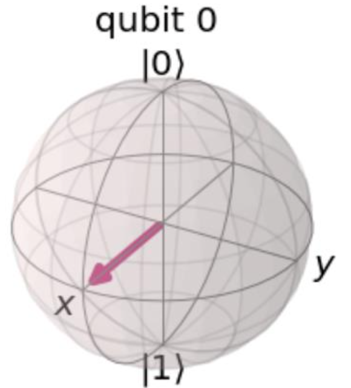
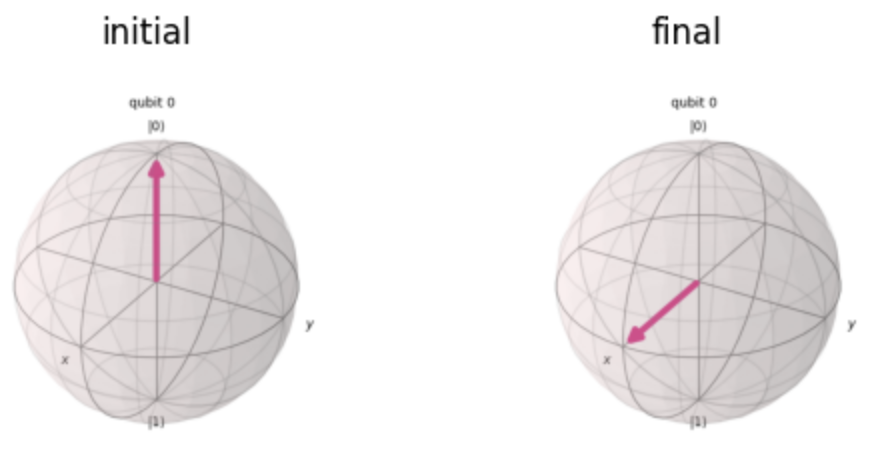

<style>
  .bg-y{
    background-color: rgb(255,255,100);
  }

  .txt-g{
    color: rgb(85,85,85);
  }
</style>


それでは早速始めていきましょう！  
第一問は基本的な量子回路を作成する問題です！！

# Q1 
> Which statement will create a quantum circuit with four quantum bits and four classical bits?  

<span class="bg-y txt-g">
[A]  
</span>
<br>
QuantumCircuit(4, 4)  

[B]  
QuantumCircuit(4)  

[C]  
QuantumCircuit(QuantumRegister(4, 'qr0'), QuantumRegister(4, 'cr1'))  

[D]  
 QuantumCircuit([4, 4])  

## Q1-1.用語
Registerという単語が出てきましたね。古典コンピュータでのレジスタとはなんだったでしょうか？レジスタは，データや処理を格納する場所である点でメモリと似ていますが，CPU内に存在している点が異なります。容量は限られている代わりにCPUと連携して動作できる分，高速な処理が可能です。メモリは記憶領域にあるので，大容量のデータを保存できる一方で動作は遅くなります。
これから扱う量子ビット, 古典ビットは全て回路内に存在していることを想定しているためメモリではなくレジスタという表現が正しいことですね😋

## Q1-2.背景
 まず，量子ビットと古典ビットの両方を用意しないといけない理由はなんでしょうか？量子コンピュータでは，重ね合わせやエンタングル状態といった量子ビット特有の状態を使って計算を実行しますが，量子ビットの状態を制御したり，状態を測定したりするのは古典ピットの役割なのです！ですので，古典ビットは量子計算の制御や制御フローの管理において重要な役割を果たしていると言えるのです😋  
 問題文は４つの量子ビットと4つの古典ビットを作るCode分の作成を求めています！


## Q1-3.選択肢解説

qiskit APIには，QuantumeCircuit Classが準備されており
```
qc = QuantumCicuit(q,c)
```
と書くことで,量子ビットをq個，古典ビットをc個をレジスタに格納した量子回路のインスタンスを作ることができます！また，ここでは取り上げていませんが下記のように量子，古典レジスタを使って回路を構成しても，問題文と同様の回路が設計できます！
```
QuantumCircuit(QuantumRegister(4,"q"), ClassicalRegister(4, "c"))
```

[A]
上の解説のq, cにそれぞれ4が入ったcodeとなり，4つの量子-古典ビットを有する量子回路を作ります。これは題意を満たし正解となります！

[B]  
引き数を1つにする場合，その数の量子ビットが作られるため 4つの量子ビットを持つ回路となります！古典ビットを準備できていないので不正解です！

[C]  
名称指定されているqr0量子ビットレジスタが4, cr1量子ビットが4つの合計8つの量子ビットが準備された回路となります。こちらも古典ビットが準備できておらず，量子ビットの数も合わないため，残念ながら不正解です！
```
QuantumCircuit(QuantumRegister(4,"q"), ClassicalRegister(4, "c"))
```
  

とかけば正解でした！

[D]  
選択肢のようにリストは引数として受け入れません！よってエラーとなってしまいます！
それぞれの数はリストの外に出して，
第一引数: 量子ビット数，第二因数: 古典ビット数
となるようにしましょう！

## Q1-4. シミュレーション
この問題はシミュレートすることないのでSkipします！

## Q1-5. Qiskit API
[QutumCircuit](https://qiskit.org/documentation/stubs/qiskit.circuit.QuantumCircuit.html)  

---

さて，第2問です！
今度は初期状態に回転操作を加えた後の操作後の状態に関する問題です！

## Q2. 
> Given this code fragment, what is the probability that a measurement would result in $\ket{0}$ ?

```
qc = QuantumCircuit(1)
qc.ry(3 * math.pi/4, 0)
```

[A]  
0.8536  

[B]  
0.5  

<span class="bg-y txt-g">
[C]   
</span><br>
0.1464  


[D]  
1.0  


## Q2-1.用語
ry(3*math.pi/4,0)はQuantumCircuitクラスに用意されたY軸方向の回転操作メソッドです。ブロッホ球上の量子状態に対して，Y軸方向に$\frac{3 \pi}{4}$回転させるユニタリ操作を表します！ちなみに，"Y軸方向に回転"とは，ネジを締める側に回したときに進む方向をY軸正方向としたときに，その回転方向を正方向とします！
また，しれっとmeasurementが出てきています。量子力学における測定は古典力学での測定ほど単純ではなく測定に確率的な要素が含まれます！この辺りは，計算をしながら考え方を確認していきましょう！量子力学的測定に関する詳しい背景は Q4.で扱うのでそこまで待ってください！


## Q2-2.背景
測定確率の計算は，ディラック記法を用いて計算してみましょう！また，状態ベクトルの回転についてはおなじみのブロッホ球を使って考えてみましょう！回転操作については直感的に理解できるので重宝しますね！これをぐりぐり回せるシミュレーションをUnityとかで描けるようになりたいなぁ🌛と思って，並行して試しに作っていますが，難しい。。。。

## Q2-3. 選択肢解説
初期状態 $\ket{0}$に対して, Y軸方向に$\theta = \frac{3 \pi}{4}$回転させた場合に，$\ket{0}$が観測される確率を求める問題です！

回転後の状態を$\ket{\Psi'}$とすると，Y軸方向の$\theta$回転後の状態は
$\ket{\Psi'} = \cos{\frac{\theta}{2}} \ket{0} + \sin{\frac{\theta}{2}\ket{1}}$となります。
上式が得られる理由は，Y軸方向の回転を操作する行列が下記で表されるためであり,  
$$
\begin{align}
    R_{Y}(\theta) =
        \left(
        \begin{matrix}
        \cos{\frac{\theta}{2}} & - \sin{\frac{\theta}{2}} \\
        \sin{\frac{\theta}{2}} & \cos{\frac{\theta}{2}}
        \end{matrix}
        \right)
\end{align}
$$  
この行列を$\ket{0}$に作用させると，$\ket{\Psi'}$が得られることが下記の計算で確かめることができます！自分でもやってみましょう！  
では，ここから$\ket{\Psi '}$に$\bra{0}$を作用させて，$\ket{0}$が測定される確率を求めてみましょう！
$$
\begin{align}
    P_{\ket{0}}  &= \braket{0|\Psi'}^2 \\
    &=\Bigl( \bra{0} (\cos{\frac{3 \pi}{8} \ket{0}} + \sin{\frac{3 \pi}{8}} \ket{1}) \Bigr)^2\\
    &= \cos^2{\frac{3 \pi}{8}} \braket{0|0} + \sin^2{\frac{3 \pi}{8}} \braket{1|0} \\
    &= \cos^2{\frac{3 \pi}{8}}
\end{align}
$$  

このとき，倍角の公式を使って$\cos^2{\frac{3 \pi}{8}}$を計算してもいいのですが，ここではざっくりとした値を求める方法をとります！個人的には一意な値を求めるより，必要なスケール感で取り得る値の範囲を把握することの方が大事だと感じているからです！そのために角度$\theta$ で $\cos^2{\frac{3 \pi}{8}}$ を評価すればよいわけです！

$\frac{\pi}{3}<\theta = \frac{3\pi}{8} < \frac{\pi}{2}$と評価できるため，

$$
\begin{align}
\cos{\frac{\pi}{2}} & < \cos{\theta} < \cos{\frac{\pi}{3}} \\
0 & < \cos{\theta} < \frac{1}{2} \\
よって，
0 & < \cos^2{\theta} < \frac{1}{4}
\end{align}
$$

つまり，選択肢の中で0より大きく$\frac{1}{4}$より小さい値となり，答えは[C]となります！今回の問題は計算結果が異なるため[C]以外の選択肢は問答無用で不正解となります！

## Q2-4.シミュレーション
観測される状態のヒストグラムを作る場合は，Aer Simulator が使えます！  
当モジュールでは量子状態測定をノイズフリーシミュレーションができるのです！
量子コンピュータにおけるノイズとは，環境ノイズやゲートエラー，量子ビット間の結合エラー，読み取りエラーなどが含まれます。それらのノイズがない，理想的な量子コンピュータを想定してシミュレーションされます。

回転後に測定される状態のヒストグラムは下記のようになります！
  
今回のシミュレーションでは，1024回の試行に対して,$\ket{0}$が144回, $\ket{1}$が880回測定されることがわかりました。つまり, 回転操作後に状態$\ket{0}$を得る確率Pは$P=\frac{144}{1024}=0.1406$であることがわかり，選択肢[C]が最も近い答えであることがわかります！

また, bloch simulator を使ったBloch球上ベクトルもシミュレートもできちゃいます！
bloch　simulatorを使って， $\ket{0}$をY軸方向に$\frac{3 \pi}{4}$回転した終状態を描画すると，下記のようになります！  

 <br>
確かに，Z軸の+方向から$\frac{3 \pi}{4}$回転しているように見えます！直感的に理解できていいですね！

---

さて次はQ3です！  
与えられた量子回路を示す図表から，python codeで正しい回路を設計する問題です！

# Q3. 
> Assuming the fragment below, which three code fragments would produce the circuit illustrated?
> 
```python 
  inp_reg = QuantumRegister(2, name='inp')
  ancilla = QuantumRegister(1, name='anc')
  qc = QuantumCircuit(inp_reg, ancilla)
  #Insert code here
```


<br>
<span class="bg-y txt-g">  
[A]<br>
</span>  
qc.h(inp_reg)<br>
qc.x(ancilla)<br>  
qc.draw()<br>

<br>
<span class="bg-y txt-g">
[B]  
</span>
<br>

qc.h(inp_reg[0:2])  
qc.x(ancilla[0])  
qc.draw()  

[C]  
qc.h(inp_reg[0:1])  
qc.x(ancilla[0])  
qc.draw()  

<span class="bg-y txt-g">
[D]  
</span>
<br>

qc.h(inp_reg[0])  
qc.h(inp_reg[1])  
qc.x(ancilla[0])  
qc.draw()

[E]  
qc.h(inp_reg[1])  
qc.h(inp_reg[2])  
qc.x(ancilla[1])  
qc.draw()  

[F]  
qc.h(inp_reg)  
qc.h(inp_reg)  
qc.x(ancilla)  
qc.draw()  

## Q3-1.用語
変数名にancillaという見慣れない言葉があります！これは量子回路で登場するancilla bitのことを指しています！アンシラビットとは，エラー訂正のパリティチェックやアルゴリズム実行時に一時的に情報を保持するために使われます。計算の結果には直接影響を与えないことが多く，あくまで補助的な役割を果たしていることがアンシラとして定義する要件です！勉強を始めた当初は　Target bitの状態を制御することもありアンシラビットに含まれるかと思っていましたが，計算結果に影響を与える点でアンシラには含まないようです。
制御ビットは，特定の条件下で量子操作を制御するために使用され，制御ゲートの制御線として利用されていると言えます。


## Q3-2.背景
inp_regの0から1番目にq0, q1量子ビットが格納されており，ancillaの0番目にanc量子ビットが格納されています。  

アダマールゲートとNOTゲートについて解説しましょう！

### アダマールゲート
アダマールゲートが使われる最も簡単な例は，量子ビットの重ね合わせです！  
アダマール変換は
$$
  \begin{align}
      \hat{H} =
      \frac{1}{\sqrt{2}}
          \left(
          \begin{matrix}
          +1 & +1 \\
          +1 & -1
          \end{matrix}
          \right)  
  \end{align}
$$
$$
  \begin{align}
  = \frac{1}{\sqrt{2}} (\ket{0}+\ket{1})\bra{0} + \frac{1}{\sqrt{2}}(\ket{0}-\ket{1})\bra{1}
  \end{align}
$$  

と表されるため，始状態が$\ket{0}$のとき，終状態は$\frac{1}{\sqrt{2}}(\ket{0}+\ket{1})$, 
始状態が$\ket{1}$のとき，終状態は$\frac{1}{\sqrt{2}}(\ket{0}-\ket{1})$となります😋
このように，アダマール変換を用いると，初期状態が１つの状態のみを持つ単一量子ビットに作用した際に，量子ビットの重ね合わせ状態を作ることができます！

### NOTゲート
NOTゲートは行列で書く場合，
$$
\begin{align}
  \hat{X} = 
    \left(
      \begin{matrix}
        0 & 1 \\
        1 & 0
      \end{matrix}
    \right)
\end{align}
$$


$$
= \ket{0}\bra{1} + \ket{1} \bra{0}
$$
と表されます！
これは，始状態が$\ket{0}$のとき終状態は$\ket{1}$, 始状態が$\ket{1}$のとき終状態$\ket{0}$となります！
つまり，始状態と反対の状態に変換する変換がNOTゲートです！

与えられた画像からinp0 とinp1にアダマールゲート，anc0にNOTゲートを作用させる量子回路が与えられており，それらを実装するためのCodeを解答する必要があります！
今回この問題を解いていて初めて知りましたが，リストのスライス表現で複数の量子ビットに同じ量子操作を実施できるらしいってことを知りました。らっきーらっきー。


## Q3-3.選択肢解説

<span class="bg-y txt-g">
[A]  
</span>  

QuantumCircuit.h(qubit)はパラメータとして，QuantumRegisterを取ります！
この時，複数のqubitを指定する場合，指定したqubit全てのアダマール変換を施します！

```python
qc.h(inp_reg)  ##複数準備された量子ビットinp_regすべてにアダマール変換を施す
qc.x(ancilla)  ## ancillaにNOT ゲートを施す
qc.draw()
```
これは題意の通りのため，正解です😋

<span class="bg-y txt-g">
[B]  
</span>  

```python
qc.h(inp_reg[0:2]) ##inp_regの0~1番目の量子ビットにアダマール変換を施す  
qc.x(ancilla[0])   ## ancillaにNOT ゲートを施す
```

これも題意の通りのため，正解です😋
[C]  
```python
qc.h(inp_reg[0:1])  ##inp_regの0番目の量子ビットにアダマール変換を施す
qc.x(ancilla[0])   ## ancillaにNOT ゲートを施す
```
これは，inp_regの1番目の量子ビットにアダマール変換が施されないため，題意を満たさず不正解です🙃 


<span class="bg-y txt-g">
[D]  
</span>  

```python
qc.h(inp_reg[0])  ##inp_regの0番目の量子ビットにアダマール変換を施す
qc.h(inp_reg[1])  ##inp_regの1番目の量子ビットにアダマール変換を施す
qc.x(ancilla[0])  ##ancillaの0番目の量子ビットにアダマール変換を施す
```
これは題意の通りのため，正解になります😋


[E]  
```python
qc.h(inp_reg[1])  ##inp_regの1番目の量子ビットにアダマール変換を施す
qc.h(inp_reg[2])  ##inp_regの2番目の量子ビットにアダマール変換を施す
qc.x(ancilla[1])  ##ancillaの1番目の量子ビットにアダマール変換を施す
qc.draw()
```  
inp_regは, 0と1番目の量子ビットの2つしかなく，２番目の量子ビットは存在しません！
そのため，2行目で "IndexError: list index out of range"となりエラーとなります！そのため不正解です🙃  

[F]  
```python
qc.h(inp_reg)  ##inp_regの0~1番目の量子ビットにアダマール変換を施す  
qc.h(inp_reg)  ##inp_regの0~1番目の量子ビットにアダマール変換を施す  
qc.x(ancilla)   ##ancillaの1番目の量子ビットにアダマール変換を施す
qc.draw()  
```
0~1番目の量子ビットに2回の
アダマール変換が解かされており，題意に反すため不正解です🙃  


## Q3-4. シミュレーション
題意の回路に測定用の古典ビットを用意して，測定される状態のヒストグラムを計算してみましょう！
  
上記のヒストグラムから，どうやらこの回路で作られる量子状態は，
$\ket{100}, \ket{101}, \ket{110}, \ket{111}$がおおよそ当確率で検出されるようです。


これらの結果は理論的に確かめることもできます!
ただし，直積状態の考え方を使うため，Q5の解説で　エンタングルしている状態，していない状態(直積状態)を学んでから戻ってくるのが良いかもしれません😭
サッと呼んで難しい場合は，次の問題に飛んじゃいましょう🛩
$\ket{zyx}$と表現する場合，x, y, zはそれぞれ$x:inp_{0}$の状態，$y:inp_{1}$の状態，$z:anc$の状態を指し，直積で表されています。  
つまり，$\ket{zyx} = \ket{z} \otimes \ket{y} \otimes \ket{x}$と計算されます。  
本来であれば，それぞれの3つの量子ビットが0と1の２つの状態を持つため，
$\ket{000}$~$\ket{111}$の合計8状態を持ちうりますが，題位で示されている回路のようににおけるアダマールゲートとNOTゲートにより，取りうる状態の割合が変化した結果，
$\ket{100}, \ket{101}, \ket{110}, \ket{111}$がおおよそ当確率で測定される状態に遷移するのです！
これを理論的に計算してみると，下記のようになります。

$$
\begin{align}
  \ket{\Psi '} &= \left( \hat{X_{z}} \otimes \ket{0_{z}} \right)
  \left( \hat{H_{y}} \otimes \ket{0_{y}} \right)
  \left( \hat{H_{x}} \otimes \ket{0_{x}} \right) \\ 
  &=  
  \left( \ket{1_{z}} \right)
  \left( \frac{1}{\sqrt{2}} ( \ket{0_{y}}+\ket{1_{y}} ) \right)
  \left( \frac{1}{\sqrt{2}} ( \ket{0_{x}}+\ket{1_{x}} ) \right) \\
  &=  \frac{1}{2} \left( 
    \ket{1_{z}} \ket{0_{y}} \ket{0_{x}} +
    \ket{1_{z}} \ket{0_{y}} \ket{1_{x}} +
    \ket{1_{z}} \ket{1_{y}} \ket{0_{x}} +
    \ket{1_{z}} \ket{1_{y}} \ket{1_{x}} 
    \right) \\
  &=
  \frac{1}{2} (\ket{100}+\ket{101}+\ket{110}+\ket{111})
\end{align}
$$
と，終状態の状態ベクトルを計算することができます。
念の為，測定後に$\ket{100}$状態が得られる確率を計算してみると
$$
\begin{align}
  P_{\ket{100}} &= \braket{100 | \Psi '}^2 \\
  &= \braket{100| \frac{1}{2} \bigl(\ket{100}+\ket{101}+\ket{110}+\ket{111} \bigr) }^2　\\
  &= \bigl( \frac{1}{2} \braket{100|100} \bigr)^2 \\
  &= (\frac{1}{2})^2 (\braket{100|100})^2 \\
  &= \frac{1}{4} \\
\end{align}
$$
となり，$\ket{100}$は$ \frac{1}{4}$の確率で測定されることが分かります😋
他の状態についても同様の計算で測定確率を導くことができ，いずれの状態も$\frac{1}{4}$の確率で検出されることが分かります。
実際に確率的に検出される量子力学の測定において1024回試行すると厳密に$\frac{1}{4}$，つまり256回ずつの検出回数とはならず，上記のヒストグラムのようなばらつきを含む結果となります😜

## Q3-5.API  
[Hadamard on qiskit API ref](https://qiskit.org/documentation/stubs/qiskit.circuit.QuantumCircuit.h.html)

---
次は, measureの扱い方と回路設計の使い方に関する問題です！

# Q4.
>Given an empty QuantumCircuit object, qc, with three qubits and three classical bits, which one of these code fragments would create this circuit?

  


<br>
<span class="bg-y txt-g">  
[A]  
</span>  

qc.measure([0,1,2], [0,1,2])  
[B]  
qc.measure([0,0], [1,1], [2,2])
[C]  
qc.measure_all()  
[D]  
qc.measure(0,1,2)


## Q4-1. 用語
測定については用語として扱わずに，下の背景partで述べます！

## Q4-2. 背景
まず，量子力学における測定で注意することはなんでしょうか？？
代表的な注意点を3つあげてみましょう😅
1. 測定が確率的である点
  - 量子状態は複数取りうる状態がある時，それらが重なり合っている場合があります。その状態を測定した場合，各測定確率に応じて各々の状態が観測されます！
2. 測定自体が(量子)状態を破壊しうる点
  - 量子力学では，測定自体が重ね合わせ状態を破壊してある一つの状態に固定させてしまう場合があります。測定によって系が特定の状態に制約されるとも言えます。また数学的には，測定は非ユニタリ操作であり，測定後に測定前の状態に可逆的に戻すことはできません！
3. 測定結果が観測者に依存しうる点
  - 量子力学における測定は，観測者+量子状態がセットである点も重要です。観測者自身やその測定手段が異なる場合，測定される状態は変わります！

## Q4-3. 選択肢解説
まずは，3つの量子ビットと3つの古典ビットを用意します！量子ビット[0,1,2]をそれぞれの順番で　古典ビット[0,1,2]で測定する回路を作成します！
qc.measureはqc.cmeasure(qubit, cbit)のように，2つのパラメータを取り，測定を実行します。  
[A]  
qc.measure([0,1,2], [0,1,2])  
これは，題意を満たしており，正解です😋

[B]  
qc.measure([0,0], [1,1], [2,2])
3つのパラメータを取っているため，TypeErrorになります！不正解🙃

[C]  
qc.measure_all()  

qc.measure_all()は，新たに測定用のcbitを追加して測定結果を保存します！
また，qc.measre_all()は，測定前にBarrierを入れる仕様になっている。
与えられた回路では，古典ビットが既に3つあるため，新たに追加される分の古典ビットが多くなるため題意に沿わなくなってしまいます。そのため不正解です🙃  


ちなみに，qc.measure_all()はparameterで既存の古典ビットに測定を保存することができます！
その場合，qc.measure_all(add_bits=False)とします！
この場合，題意を満たすため正解となります！  


[D]  
qc.measure(0,1,2)
これも[B]同様，3つのパラメータを取っているため，TypeErrorになります！もち不正解です🙃

### Q4-4. シミュレーション
今回シミュレーションすることは特にありません！


---
次はエンタングル状態に関する問題です！

# Q5
> Which code fragment will produce a maximally entangled, or Bell, state?

<span class="bg-y txt-g">
[A]  
</span><br>
bell = QuantumCircuit(2)<br>
bell.h(0)<br>
bell.x(1)<br>
bell.cx(0, 1)<br>  

[B]  
bell = QuantumCircuit(2)  
bell.cx(0, 1)  
bell.h(0)  
bell.x(1)  

[C]  
bell = QuantumCircuit(2)  
bell.h(0)  
bell.x(1)  
bell.cz(0, 1)  

[D]  
bell = QuantumCircuit(2)  
bell.h(0)  
bell.h(0)


## Q5-1.用語
エンタングルとベル状態について解説しましょう！量子計算の醍醐味ですね！
エンタングルとは，2つ以上の"量子ビット同士が従属している状態"を指します。とはいえ，"量子ビット同士が従属"?なんのこっちゃという感じです。。。。解説が長くなるので，既に理解している人は飛ばして呼んでください🛩

私に関していうと，"従属"の対義語である"独立"であること合わせて考えると腹落ちがよく，理解することができました！まずはある２つの量子ビットが"独立である"場合の状態について深めていきましょう！

まず，"独立"とは"相手(他者)に影響を受けない，与えない"状態を指します。
経済的な"独立"や，アメリカ"独立"宣言など日常的な用語でも理解ができるかと思います！量子ビットの場合も同様です！
2つの量子ビットをそれぞれ$\ket{q_{0}}, \ket{q_{1}}$としましょう！
そして，２つの量子ビットを合わせた量子状態を$\ket{\Psi}$としましょう。

### i.) それぞれの量子ビットが独立で単一の状態を持つ場合
仮に$\ket{q_{0}}$は$\ket{0}$, $\ket{q_1}$が$\ket{0}$の状態をとる場合，量子状態$\ket{\Psi}$は
$$
\begin{align}
  \ket{\Psi} &= \ket{0_{q_{0}}} \otimes \ket{0_{q_{1}}} \\
  &= \ket{0} \ket{0} \\
  &= \ket{00}
\end{align}
$$
と表され，全体としての量子状態は唯一の状態$\ket{00}$を取ります。
それぞれ１つの状態しか取らないので全体としても１つの状態となるのは，理解しやすいかと思います。  
では，どちらかが2つの量子状態を持つ場合はどうなるでしょうか？

### ii.) 1方が1状態，他方が2状態の重ね合わせの場合
次に, $\ket{q_{0}}=\ket{0}$, $\ket{q_{1}}= \frac{1}{\sqrt{2}} \left( \ket{0} + \ket{1} \right)$をとる場合を考えてみましょう！$\ket{q_{0}}$はi.) と同様に唯一の状態を取りますが，$\ket{q_{1}}$は2状態が重ね合わせられており，測定した場合$\frac{1}{2}$の確率でそれぞれ$\ket{0}, \ket{1}$が測定される状態です。ただし，$\ket{q_{0}}$と$\ket{q_{1}}$は独立であり，それぞれに影響を与えることはありません。このとき，全体としての量子状態$\ket{\Psi}$はどうなるでしょうか？？シンプルに考えると，①$\ket{q_{0}}$が$\ket{0}$で$\ket{q_{1}}$が$\ket{0}$と,
②$\ket{q_{0}}$が$\ket{0}$で$\ket{q_{1}}$が$\ket{1}$の2状態があり得そうですね！これは，それぞれが独立であれば，起こりうる事象は積事象として表されることから，計算で導出することができます。これが量子状態でいう"直積"状態です！簡単ですが計算して確かめてみましょう！
$$
\begin{align}
  \ket{\Psi} &= \ket{q_{0}} \otimes \ket{q_{1}} \\
  &= \ket{0_{q_{0}}} \otimes \frac{1}{\sqrt{2}} \left( \ket{0_{q_{1}} + \ket{1_{q_{1}}}} \right) \\
  &= \frac{1}{\sqrt{2}} \left( \ket{0_{q_{0}}} \otimes \ket{0_{q_{1}}} + \ket{0_{q_{0}}} \otimes \ket{1_{q_{1}}} \right)　\\
  &= \frac{1}{\sqrt{2}} \left( \ket{0_{q_{0}}} \ket{0_{q_{1}}} + \ket{0_{q_{0}}} \ket{1_{q_{1}}} \right) \\
  &= \frac{1}{\sqrt{2}} \left( \ket{0_{q_{0}} {0_{q_{1}}}} + \ket{0_{q_{0}} 1_{q_{1}}} \right) \\
  &= \frac{1}{\sqrt{2}} \left( \ket{00} + \ket{01} \right) \\
\end{align}
$$
この積事象(直積)の計算から，上記の２状態となることが分かります！
重要なことなのでもう一度書きますが，上記のように積事象(直積)で表されるのは，２つの状態が独立であるからです！

### では，エンタングルとは何か？
エンタングル状態では，上記のようにそれぞれの量子ビットが独立ではなく，従属関係にあります！つまり，上記のような直積状態で表現できない状態がエンタングルメント状態と言えます。
２量子ビットが直積で表すことのできる状態は全部で7種類です！
計算しながら確認してみましょう！
$$
\begin{align}
  \ket{\Psi_{0}} &= \alpha \ket{0_{q_{0}}} \otimes \beta \ket{0_{q_{1}}} \\
  &= \alpha \beta \ket{0_{q_{0}}} \ket{0_{q_{1}}} \\
  &= \alpha \beta \ket{0} \ket{0}
\end{align}
$$

$$
\begin{align}
  \ket{\Psi_{1}} &= \alpha \ket{1_{q_{0}}} \otimes \beta \ket{1_{q_{1}}} \\
  &= \alpha \beta \ket{1_{q_{0}}} \ket{1_{q_{1}}} \\
  &= \alpha \beta \ket{1} \ket{1}
\end{align}
$$

$$
\begin{align}
  \ket{\Psi_{2}} &= \alpha \ket{0_{q_{0}}} \otimes  \left( 
    \beta \ket{0_{q_{1}}} + \gamma \ket{1_{q_{1}}} \right) \\
  &= \alpha \beta \ket{0_{q_{0}}} \ket{0_{q_{1}}} +  \alpha \gamma \ket{0_{q_{0}}} \ket{1_{q_{1}}} \\
  &= \alpha \beta \ket{00} + \alpha \gamma \ket{01}
\end{align}
$$

$$
\begin{align}
  \ket{\Psi_{3}} &= \alpha \ket{1_{q_{0}}} \otimes \left( 
    \beta \ket{0_{q_{1}}} + \gamma \ket{1_{q_{1}}} \right) \\
  &= \alpha \beta \ket{1_{q_{0}}} \ket{0_{q_{1}}} + \alpha \gamma \ket{1_{q_{0}}} \ket{1_{q_{1}}} \\
  &= \alpha \beta \ket{10} + \alpha \gamma \ket{11}
\end{align}
$$

$$
\begin{align}
  \ket{\Psi_{4}} &= \left( \alpha \ket{0_{q_{0}}} + \beta \ket{1_{q_{0}}} \right) \otimes \gamma \ket{0_{q_{1}}} \\
  &= \alpha \beta \ket{0_{q_{0}}} \ket{0_{q_{1}}} +  \alpha \gamma \ket{1_{q_{0}}} \ket{0_{q_{1}}}  \\
  &= \alpha \beta \ket{00} + \alpha \gamma \ket{10}
\end{align}
$$

$$
\begin{align}
  \ket{\Psi_{5}} &= \left( \alpha \ket{0_{q_{0}}} + \beta \ket{1_{q_{0}}} \right) \otimes \gamma \ket{1_{q_{1}}} \\
  &= \alpha \gamma \ket{0_{q_{0}}} \ket{1_{q_{1}}} + \beta \gamma \ket{1_{q_{0}}} \ket{1_{q_{1}}}  \\
  &= \alpha \beta \ket{01} + \alpha \gamma \ket{11} 
\end{align}
$$


$$
\begin{align}
  \ket{\Psi_{6}} &= \left( \alpha \ket{0_{q_{0}}} + \beta \ket{1_{q_{0}}} \right) \otimes \left( \gamma \ket{0_{q_{1}}} + \delta \ket{1_{q_{1}}} \right) \\
  &= \alpha \gamma \ket{0_{q_{0}}} \ket{0_{q_{1}}} +  \beta \gamma \ket{1_{q_{0}}} \ket{0_{q_{1}}} + \alpha \delta \ket{0_{q_{0}}} \ket{1_{q_{1}}} + \beta \delta \ket{1_{q_{0}}} \ket{1_{q_{1}}} \\
  &= \alpha \gamma \ket{0} \ket{0} +  \beta \gamma \ket{1} \ket{0} + \alpha \delta \ket{0} \ket{1} + \beta \delta \ket{1} \ket{1}\\
  &= \alpha \gamma \ket{00}+  \beta \gamma \ket{01}+ \alpha \delta \ket{10} + \beta \delta \ket{11}\\
\end{align}
$$

それでは，エンタングル状態の例を用いて考えます。
たとえば，ベル状態は以下です。
$$
\begin{align}
  \ket{\Phi^{+}} = \frac{1}{\sqrt{2}} \left( \ket{00} + \ket{11} \right) \\
  \ket{\Phi^{-}} = \frac{1}{\sqrt{2}} \left( \ket{00} - \ket{11} \right) \\
  \ket{\Psi^{+}} = \frac{1}{\sqrt{2}} \left( \ket{01} + \ket{10} \right) \\
  \ket{\Psi^{-}} = \frac{1}{\sqrt{2}} \left( \ket{01} - \ket{10} \right) \\
\end{align}
$$
直積状態で表すことのできる状態の組み合わせの中に，ベル状態の4状態は含まれないことが分かります。つまり，ベル状態は2量子ビットの直積で表すことができないお互いに従属した関係であることと言えます！

## Q5-2. 背景
今回の問題はいかにベル状態を作るかの問題です！
問題文に制御NOT, 制御Zゲートが出てくるのでそれぞれどういうゲートなのかについて解説したいと思います！

###  量子状態ベクトル表現の定義
初期状態を$\ket{\Psi_{0}}$, 終状態を$\ket{\Psi_{1}}$とします！
また，状態ベクトルの各要素は
$$
\begin{align}
  \ket{\Psi} &= 
    \begin{pmatrix}
      c_{00}:\ket{0_{t}0_{c}}の確率振幅 \\
      c_{10}:\ket{1_{t}0_{c}}の確率振幅 \\
      c_{01}:\ket{0_{t}1_{c}}の確率振幅 \\
      c_{11}:\ket{1_{t}1_{c}}の確率振幅 \\
    \end{pmatrix} \\
\end{align}
$$
とします。

$\hat{CX}$:CNOT(制御NOT)ゲート, $\hat{CZ}$:CZゲートは以下の通りです！
### 制御NOTゲート
制御NOTゲートは  
①Contolビットが$\ket{0}$のときはTargetビットには何もせず,  
②Controlビットが$\ket{1}$のとき，Targetビットの状態を反転させる  
ゲートです！
まずはディラック表示では下記のように表現されます！
それぞれ添字がついていますが，tはTarget, cはControlを表しています。
$$
\begin{align}
\hat{CX}
&= \Bigl( \ket{0}_t \bra{0}_t + \ket{1}_t \bra{1}_t \Bigr) \otimes \Bigl( \ket{0_c} \bra{0_c} \Bigr) + \Bigl( \ket{1}_t \bra{0}_t + \ket{0}_t \bra{1}_t \Bigr) \otimes \Bigl( \ket{1}_c \bra{1}_c \Bigr) \\
&=\ket{00} \bra{00} + \ket{10} \bra{10} + \ket{11} \bra{01} + \ket{01} \bra{11}
\end{align}
$$


$$
\begin{align}
  \hat{CX}= 
      \left(
          \begin{matrix}
          1 & 0 & 0 & 0 \\
          0 & 1 & 0 & 0 \\
          0 & 0 & 0 & 1 \\
          0 & 0 & 1 & 0 \\
          \end{matrix}
      \right) \\
\end{align}
$$
として表されます！
試しに，初期状態$\ket{{\Psi_0}}$として下記のように定義して，$\hat{CX}$を作用させると
$$
\begin{align}
  \ket{\Psi_{0}}
      &=
  \left(
    \begin{matrix}
      c_{00} \\
      c_{10} \\
      c_{01} \\
      c_{11}
    \end{matrix}
  \right) \\
    & = c_{00} \ket{0}_t \otimes  \ket{0}_c +
    c_{10} \ket{1}_t \otimes \ket{0}_c + 
    c_{01} \ket{1}_t \otimes \ket{0}_c + c_{11} \ket{1}_t \otimes \ket{1}_c \\
    & = c_{00} \ket{00}+ c_{10} \ket{10} + c_{01} \ket{01} + c_{11} \ket{11}\\ 
\ket{\Psi'} &= \hat{CX} \ket{\Psi_0} \\
&= c_{00} \ket{00}+ c_{10} \ket{10} + c_{01} \ket{11} + c_{11} \ket{01}\\ 
\end{align} \\
$$

となり，$\ket{01}$と$\ket{11}$状態の確率振幅が入れ替わることが確認できます！

###　制御Z(位相反転)ゲート

また，制御Zゲートは，
①Contolビットが$\ket{0}$のときはTargetビットには何もせず,  
②Controlビットが$\ket{1}$のとき，Targetビットの位相を反転させる  
ゲートです！
制御Zゲートの行列，ディラック表現は下記のようになります！
$$
\hat{CZ} = \Bigl( \ket{0}_t \bra{0}_t + \ket{1}_t \bra{1}_t \Bigr) 
\ket{0}_c + \Bigl( \ket{0}_t \bra{0}_t + e^{\pi}\ket{1}_t \bra{1}_t \Bigr) \ket{1}_c \bra{1}_c 
$$

これを行列表現にすると，
$$
\begin{align}
\hat{CZ} =
  \left(
    \begin{matrix} 
    +1 & 0 & 0 & 0 \\
    0 & +1 & 0 & 0 \\
    0 & 0 & +1 & 0 \\
    0 & 0 & 0 & +e^{\pi} \\
    \end{matrix}
  \right)\\
\end{align}
$$
と表されます。
$\hat{CX}$の時と同様に，ベクトル$\ket{\Psi_{0}}$に作用させると
$$
\begin{align}
  \ket{\Psi'} &= \hat{CZ} \ket{\Psi_{0}}  \\
  &= c_{00} \ket{00}+ c_{10} \ket{10} + c_{01}\ket{01} +e^{\pi}c_{11} \ket{11}\\ 
  &= c_{00} \ket{00}+ c_{10} \ket{10} + c_{01}\ket{01} -c_{11} \ket{11}\\
\end{align}  
$$
となり，$\ket{11}$の符合が反転(位相が$\pi$回転)することを確認できます！

## Q5-3.  選択肢解説
各設問の量子操作後の終状態を計算してみましょう！
２量子ビットそれぞれのオペレーションをして直積で計算してみましょう！

#### 選択肢[A]
下記の計算が実行されます！そんなに難しくないので，冗長に感じるかもしれませんが耐えましょう！
まず，$\ket{q_{0}}$, $\ket{q_{1}}$のそれぞれに対して独立にアダマールゲート，NOTゲートが適用されます！
$$
\begin{align}
    \ket{q_{0}'} &= \hat{H} \ket{0}_{q_{0}} \\
    &= \frac{1}{\sqrt{2}} (\ket{0}_{q_{0}} + \ket{1}_{q_{0}}) \\
\ket{q_{1}'} &= \hat{X} \ket{0}_{q_{1}} \\
&= \ket{1}_{q_{1}}
\end{align}
$$
次にCNOTゲートが適用されるため，$\ket{q_{0}}, \ket{q_{1}}$を直積状態にして表現したのちに，CNOTゲートを適用するのので下記の計算してみましょう！すると，
$$
\begin{align}
  \ket{\Psi'} &= \ket{q'_{1}} \otimes \ket{q'_{0}} \\
  &= \frac{1}{\sqrt{2}} (\ket{10}+\ket{11}) \\
\end{align}
$$
CNOTゲートを適用すると
$$
\begin{align}
\hat{CNOT_{q_{0}, q_{1}}} \ket{\Psi'} &= \frac{1}{\sqrt{2}} (\ket{10} + \ket{01})
\end{align}
$$
となることが分かります！これは，直積状態で作ることができない状態でエンタングルしていると言えます！よって，正解となります😋
また，それぞれの確率振幅からそれぞれの状態は等しい確率で測定されることが分かりますね！

#### 選択肢[B]
どんどん計算していきましょう！

$$ 
\begin{align}
  \ket{\Psi'} &= \ket{0}_{q_{0}} \otimes \ket{0}_{q_{0}} \\
  &= \ket{00} \\
\end{align}
$$
CNOTゲートを適用すると
$$
\begin{align}
  \hat{CNOT}_{q_{0},q_{1}} \ket{\Psi'} &= \ket{00} \\
\hat{X}_{q_{1}} \hat{H}_{q_{0}} \ket{\Psi'} &= \frac{1}{\sqrt{2}} ( \ket{11} + \ket{10} ) \\
\end{align}
$$
この結果から，終状態は$\ket{11}, \ket{10}$の2種類となり，これらは直積で表現できる状態です。つまり，それぞれは独立の状態と言えエンタングルしていないと言えます。そのため，題意を満たさず不正解となります🙃

#### 選択肢[C]
どんどん行きましょう！
$$
\begin{align}
    \ket{q_{0}'} &= \hat{H} \ket{0}_{q_{0}} \\
    &= \frac{1}{\sqrt{2}} (\ket{0}_{q_{0}} + \ket{1}_{q_{0}}) \\
\ket{q_{1}'} &= \hat{X} \ket{0}_{q_{1}} \\
&= \ket{1}_{q_{1}} \\
\ket{\Psi'} &= \ket{q'_{1}} \otimes \ket{q'_{0}} \\
  &= \frac{1}{\sqrt{2}} (\ket{10}+\ket{11}) \\
\end{align}
$$
ここに$CZ$ゲートを適用すると

$$
\hat{CZ}_{q_{0}, q_{1}} \ket{\Psi'} = \frac{1}{\sqrt{2}} ( \ket{10} - \ket{11})
$$
となります。これは選択肢[B]と同様に直積で表現できる状態のためエンタングルしていないと言えません。そのため，題意を満たさず不正解となります🙃

#### 選択肢[D]
どんどんどんどんに行きましょう！
$$
\begin{align}
    \ket{q_{0}'} &= \hat{H} \ket{0}_{q_{0}} \\
    &= \frac{1}{\sqrt{2}} (\ket{0}_{q_{0}} + \ket{1}_{q_{0}}) \\
\ket{q_{0}''} &= \hat{H} \frac{1}{\sqrt{2}}( \ket{0}_{q_{0}} + \ket{1}_{q_{0}} ) \\
    &= \frac{1}{2} \Bigl( (\ket{0}_{q_{0}}+ \ket{1}_{q_{0}}) + (\ket{0}_{q_{0}} - \ket{1}_{q_{1}}) \Bigr) \\
    &= \ket{0}_{q_{0}} \\
\ket{\Psi'} &= \ket{q_{1}} \otimes \ket{q''_{0}} \\
&=\ket{0}_{q_{1}} \otimes \ket{0}_{q''_{0}} \\
&= \ket{00}
\end{align}
$$
となります。この結果は，最後は$\ket{00}$の唯一の状態となります！これはもちろん題意を満たさず不正解となります🙃


## Q5-4.シミュレーション
Aer Simulatorでそれぞれの測定頻度をPlotしてみましょう！


上記の結果の通り，$\ket{q_{0}} \otimes \ket{q_{1}}$の直積状態で表されるのは, 
選択肢の[A]のみですね！

ちなみに[B], [C]は$\left( \ket{1} \otimes \frac{1}{\sqrt{2}} (\ket{0} + \ket{1}) \right)$, [D]は $\left( \ket{0} \otimes \ket{0} \right)$の直積で表すことができるため，エンタングル状態ではありません。[A]のみ直積では表すことができないため，エンタングルしていると言えるのです🤔
これは，上記で手計算でじっくり計算した結果と測定確率は合致していることが確認できますね！

## Q5-5. API
[QuantumCircuit.cx](https://qiskit.org/documentation/stable/0.36/stubs/qiskit.circuit.QuantumCircuit.cx.html)
第1, 2にどちらの量子ビットを入れるかを混同してしまいます💦紛らわしいですが，第1因数に制御ビット，第2因数にターゲットビットを設定します！ここで覚えてしまいましょう！

---

次は，ブロッホ球上の回転に関する問題です！

# Q6
> Given this code, which two inserted code fragments result in the state vector represented by this Bloch sphere?
```python
  qc = QuantumCircuit(1,1)
  # Insert code fragment here
  simulator = Aer.get_backend('statevector_simulator')  
  job = execute(qc, simulator)  
  result = job.result()  
  outputstate = result.get_statevector(qc)  
  plot_bloch_multivector(outputstate)
```


<br>
<span class="bg-y txt-g">
[A]  
</span><br>
qc.h(0)  

[B]  
qc.rx(math.pi / 2, 0)  

<span class="bg-y txt-g">
[C]  
</span><br>  

qc.ry(math.pi / 2, 0)  

[D]  
qc.rx(math.pi / 2, 0)  
qc.rz(-math.pi / 2, 0)  

[E]  
qc.ry(math.pi, 0)


## Q6.1 用語
rxゲート,ryゲート, rzゲートはそれぞれX,Y,Z軸周りの回転する単一量子ビットゲートです！


## Q6.2 背景  
今回の背景では，ブロッホ級上のベクトルの回転について考えたいと思います！
X軸周りの回転とは，X軸の正方向にネジが進むように回す方向をいい，もちろん他の軸周りでも同様です！それぞれの軸周りに$\frac{\pi}{2}$回転させて場合の状態ベクトルを下記に示します！

#### X軸回りの$\frac{\pi}{2}$回転
回転後は,Y軸の負方向に倒れたベクトルとなることが分かりますね！


#### Y軸周りの$\frac{\pi}{2}$回転
回転後は,X軸の正方向に倒れたベクトルとなることが分かりますね！


#### Z軸周りの$\frac{\pi}{2}$回転
Z軸上の状態ベクトルは，Z軸回りに回転させても同じ位置にいるため，
見かけ上回転していないように見えます！


## Q6.3  選択肢解説
各選択肢のユニタリ操作後の状態ベクトルを下記に示します！
問題文で示されている状態は，$\ket{+X}=\frac{1}{\sqrt{2}} ( \ket{0} + \ket{1} )$ です！これは，回転軸と角度からわかる通り，$\ket{0}$からY軸周りに$\frac{\pi}{2}$回転させることで得られることが分かります！
また，これはアダマール変換とも等価です！

選択肢[A]はアダマール変換のため，題意を満たし正解です😋
アダマール変換後の状態ベクトルは


選択肢[B]は背景で解説したX軸周りの$\frac{\pi}{2}$の回転と同じです！
これは題意に反するため，不正解です🙃

選択肢[C]は背景で解説したY軸周りの$\frac{\pi}{2}$の回転と同じです！
これは，題意を満たすため正解です😋

選択肢[D]は下記のようになります！これは題意に反するため不正解です🙃


## Q6.4 シミュレーション
今回は，上で状態ベクトルシミュレーションを実施しているため，
ここでの議論はSkipとさせていただきます！

## Q6.5 Qiskit API
[hadamard](https://qiskit.org/documentation/stubs/qiskit.circuit.QuantumCircuit.h.html)

## Q6.6  言い残し


---
次は位相ゲートに関する問題です！
# Q7.

> S-gate is a Qiskit phase gate with what value of the phase parameter?

[A]  
π/4  

<span class="bg-y txt-g">
[B]<br>  
</span>
π/2
<br>

[C]  
π/8  

[D]  
π

# Q7.1 用語
Z軸周りの回転ゲートは位相ゲートと呼ばれており，それぞれ回転角度が$\frac{\pi}{2}, \frac{\pi}{4}$ には名称がついており，それぞれS, T ゲートと呼びます！
今回は，Sゲートのため，X軸周りの$\pi / 2$の回転ゲートを示すものを選びます！

# Q7.2 背景
そもそも位相ゲートとは何でしょうか？？
一言で言えば，量子的干渉の仕方が変得るために位相を変化させるゲートです！
量子的干渉は位相部のみで決まるものではありませんが，位相が変化すると周波数に応じた干渉の程度が変わり後の終状態に変化を与えます！


# Q7.3 選択肢解説
選択肢は$\pi / 4$である[A]のみが正解です😋

# Q7.4 シミュレーション
特に今回はシミュレーションすることはありません！

# Q7.5 Qiskit API


---
<br>

## Q8. 
> Which two code fragments, when inserted into the code below, will produce the statevector shown in the output?
  
```python 
from qiskit import QuantumCircuit, Aer, execute
from math import sqrt
qc = QuantumCircuit(2)  
# Insert fragment here  
simulator = Aer.get_backend('statevector_simulator')  
result = execute(qc, simulator).result()  
statevector = result.get_statevector()  
print(statevector)
```

Output:
[0.707+0.j  0.+0.j  0.+0.j  0.707+0.j]

<span class="bg-y txt-g">
[A]  <br>
</span>
v = [1/sqrt(2), 0, 0, 1/sqrt(2)] <br>
qc.initialize(v,[0,1])  
<br>
<span class="bg-y txt-g">
[B]  <br>
</span>
qc.h(0) <br>
qc.cx(0,1)  

[C]  
v1, v2 = [1,0], [0,1]  
qc.initialize(v1,0)  
qc.initialize(v2,1)  

[D]　　
qc.cx(0,1)  
qc.measure_all()  

[E]  
qc.h(0)  
qc.h(1)  
qc.measure_all()

## Q8.2 背景
何度も出てくるので覚えておいた方がいい数字が0.707！
これは$\frac{1}{\sqrt{2}}$です！
つまり，Outputで表現されているベクトルは
$$
\begin{align}
\ket{v} &= 
\left(
    \begin{matrix}
      \frac{1}{\sqrt{2}}  \\
      0 \\
      0 \\
      \frac{1}{\sqrt{2}} \\
    \end{matrix}
\right) \\
&= \frac{1}{\sqrt{2}} (\ket{00} + \ket{11})
\end{align}
$$
となります！
上記のベクトルとなるゲートの組み合わせを探しましょう！

ちなみに，qc.initializeが初めて出てきたので，選択肢解説にいく前に使い方を解説しましょう！
第1引数には量子状態を指定するパラメータ，第2因数は量子レジスタを指定します。
この量子状態を指定するパラメータは主に3種類です！
i.) 文字列でパウリ行列の固有値を指定する方法
[label](https://qiskit.org/documentation/locale/ta_IN/stubs/qiskit.quantum_info.Statevector.from_label.html#qiskit.quantum_info.Statevector.from_label)の中からstringで指定する
ii.) 数値のリストで確率振幅を指定する方法
iii.) 10進数を代入し，その2進数表現の量子状態を指す方法

## Q8.3 選択肢解説

#### 選択肢[A]
上記のパラメータの指定方法のii.)に該当する方法で，ベル状態を作っています！そのため題意を満たし正解となります😋

#### 選択肢[B]  
状態を計算すると下記のようになります。
$$
\begin{align}
  \ket{v_{0}'} &= \hat{H} \ket{0}_{v_{0}} \\
    &= \frac{1}{\sqrt{2}} (\ket{0}_{q_{0}} + \ket{1}_{v_{0}}) \\
  \ket{q_{1}} &= \ket{1}_{v_{1}} \\
  \ket{\Psi'} &= \ket{v_{1}} \otimes \ket{v'_{0}} \\
  &= \frac{1}{\sqrt{2}} (\ket{00}+\ket{01}) \\
\end{align}
$$
ここにCNOT(q0, q1)が適用され，
$$
\begin{align}
  \hat{CNOT}_{v_{0},q_{1}} \ket{\Psi'} &= \frac{1}{\sqrt{2}} (\ket{00}+\ket{11})  \\
\end{align}
$$
となります。これは $\ket{00}$ と$\ket{11}$の振幅を$\frac{1}{\sqrt{2}}$に設定しており，ベル状態となっています！これは，題意合致するため正解です😋

#### 選択肢[C]  
今回は上記のiii.)の方法で初期化されており, $\ket{v_{0}}, \ket{v_{1}}$はそれぞれ$\ket{v_{0}}=\ket{0}, \ket{v_{1}}=\ket{1}$で初期化されます！両方の直積として状態は$\ket{\Psi} = \ket{1} \otimes \ket{0} = \ket{10}$となります！これは，題意に反するため不正解となります🙃  

#### 選択肢[D]  
初期状態が$\ket{00}$ に対して，制御NOTで操作しても，状態は変わらないため，最終的な結果は$\ket{00}$となります！

#### 選択肢[E]  
ディラック表記で計算すると下記のようになります！
$$
\begin{align}
  \ket{q_{0}} &= \hat{H} \ket{0}_{q_{0}} \\
  &= \frac{1}{\sqrt{2}} ( \ket{0}_{q_{0}} + \ket{1}_{q_{0}})\\
  \ket{q_{1}} &= \hat{H} \ket{0}_{q_{1}} \\
  &= \frac{1}{\sqrt{2}} ( \ket{0}_{q_{1}} + \ket{1}_{q_{1}})\\
  \ket{\Psi} &= \ket{q_{0}} \otimes \ket{q_{1}}\\
  &= \frac{1}{2}(\ket{00}+\ket{10}+\ket{10}+\ket{11})
\end{align}
$$


## Q8.4 シミューレータ
選択肢の[A]~[E]のそれぞれの量子状態を測定した際のヒストグラムは下記の通りになります！上の計算通りの計測結果になってますね！


## Q8.5 Qiskit API
[qc.initialize](https://qiskit.org/documentation/locale/ta_IN/stubs/qiskit.circuit.QuantumCircuit.initialize.html)
## Q8.6  言い残し


# Q9. 

> Which code fragment will produce a multi-qubit gate other than a CNOT ?

[A]  
qc.cx(0,1)  

[B]  
qc.cnot(0,1)  

[C]  
qc.mct([0],1)  

[D]  
qc.cz(0,1)

## 答え  
[D]

## Q9.1 用語
今まで出てきた用語ばかりですね！

## Q9.2 背景
背景についても特にありません！

## Q9.3  選択肢解説
methodで用意されている制御NOTのParametersは　qc.cx(control, target)の順で指定します！
[A], [B]
cx, cnot　methodは同じ使い方が可能です！

[C]
また複数の制御ビットを持つNOT Gateを使いたい時は.mct methodも用意されています。qc.cxとの違いは，制御ビットを複数指定できる点です！第1因数としてリストを与えると，制御ビットとして用いるqubitを指定することができるのです！例えば，下記のように2つの制御ビットを持つ制御NOT(toffoli) Gateを作ることができます！
```python 
qc = QuantumCircuit(3)
qc.mct([0, 1], 2)
qc.draw()
```


[D]
Q5.で出てきたように制御ZGateは，制御ビットが1, かつTargetビットが1の時，そのTarget ビットの位相を反転させます。これは，CXゲートとは異なる操作になるため不正解です！🙃

## Q9.4 シミューレータ
今回はシミュレートすることは特にありません！

## Q9.5 Qiskit API
[qc.mct](https://qiskit.org/documentation/stable/0.19/stubs/qiskit.circuit.QuantumCircuit.mct.html)


# Q10
> Which code fragment will produce a multi-qubit gate other than a Toffoli?

[A]  
qc.ccx(0,1,2)  

[B]  
qc.mct([0,1], 2)  

[C]  
from qiskit.circuit.library import CXGate  
ccx = CXGate().control()  
qc.append(ccx, [0,1,2])  

<span class="bg-y txt-g">
[D]  
</span>

qc.cry(0,1,2)  


## Q10.1 用語
Toffoliゲートは，シンプルにはANDゲートの量子版です！
3つの量子ビットを操作するゲートであり，2つの制御量子ビットが1の状態のときのみ，3つめのTarget量子ビットにXゲートを適用します。
q0_control|q1_control|q2_target|
---|---|---|
0|0|0|
0|1|0|
1|0|0|
1|1|1|
0|0|1|
0|1|1|
1|0|1|
1|1|0|

## Q10.2 背景
### Toffoliゲートの使い所
Toffoliは量子計算のさまざまなアルゴリズムで使用されます！特に、量子エラー訂正など、誤り訂正や制御フローの実装などの応用で重要な役割を果たすようです(自分はまだ勉強中。。。)。また、Toffoliゲートは量子ビットの制御可能なユニバーサルセット（controlled-NOTゲートとHadamardゲートとの組み合わせ）の一部でもあります。


### ユニバーサルセットについて
量子計算における量子操作を近似的に実現するために基本的なゲートのセットのことを言います。個セットによって，量子アルゴリズムの計算を実行するために必要な全ての操作を実現することができます。
具体的には以下の3つのゲートから構成されます。
1. 任意の単一量子ビットゲート
2. CNOTゲート
3. 1.2.の組み合わせ

toffoliゲートを単一量子ビットゲートとCNOTで表現すると下記のようになる。
(自分ではとても思いつきませんが，qiskit libraryに描いてもらうことができます。)


## Q10.3  選択肢解説
[A]はQutumCircuit　classのccxメソッドに関する選択肢です。ccxメソッドはccx(q0, q1, target_bit)のように3つの量子ビットをparametersとしてとるのです。選択肢は
"0", "1", の量子ビットを制御ビット，"2"をターゲットビットとして指定できており題意を満たしています！<br>

[B]はQutumCircuit classのmctメソッドに関する選択肢です。mctメソッドはmct(control_qbits,target_bit)をパラメータに取ります。control_qbitsはリストで指定することができるため，[B]は[A]同様，"0", "1", の量子ビットを制御ビット，"2"をターゲットビットとして指定できており題意を満たしています！<br>

[C]はCXGate classに関する選択肢です。CXGateはClassのため，制御NOTゲートのインスタンスを作る必要があります。自分でインスタンス化できる分，より柔軟にゲート設計できるのでしょうか...利点をよくわかっていません。。。
選択肢の書き方をもう少し書き下すと，下記のようになります。
```python
cx = CXGate() #CXGateのインスタンスを作る
ccx = cx.control()  #CXGateのcontrolメソッドを使って，制御ビットを１つ増やしてCCXにする
qc.append(ccx, [0,1,2]) #量子回路qcにCCXゲートを追加する形で実装する。
```
qcのappendメソッドでCXを追加する場合，リストの末尾をTargetビットに指定します。
そのため，グラフに起こすと下記のようになります。

appendで渡す際に，[0,2,1]と指定すると，制御ビットが[q0,q2]でターゲットビットが[q1]として指定されます。 


[D]はqc.cryメソッドに関する選択肢です！(theta, control_bit, target_bit)の順にParameterをとります！選択肢[D]のように指定すると，１番目のqbitが1の時にq2に0degのY軸方向の回転を加えることを意味しています！
これは，題意のようなToffoliゲートにはなり得えません！なので不正解です🙃
## Q10.4 シミューレータ　
今回もシミュレーションは特にありません！

## Q10.5 Qiskit API
[qc.ccx](https://qiskit.org/documentation/stubs/qiskit.circuit.QuantumCircuit.ccx.html)

[qc.mct](https://qiskit.org/documentation/stubs/qiskit.circuit.QuantumCircuit.mct.html)

[CXGate](https://qiskit.org/documentation/stubs/qiskit.circuit.library.CXGate.html)

[qc.append](https://qiskit.org/documentation/stubs/qiskit.circuit.QuantumCircuit.append.html)

[qc.cry](https://qiskit.org/documentation/stubs/qiskit.circuit.QuantumCircuit.cry.html)


# Q11
> Which two options would place a barrier across all qubits to the QuantumCircuit below?

```python
  qc = QuantumCircuit(3,3)
```
[A]  
qc.barrier(qc)  

<span class="bg-y txt-g">
[B]  
</span>  

qc.barrier([0,1,2])  

<span class="bg-y txt-g">
[C]  
</span>

qc.barrier()  

[D]  
qc.barrier(3)  

[E]  
qc.barrier_all()  

## Q11.1 用語

QuantumCircuitのbarrierメソッドに関する設問です。さて，barrierとは一体なんでしょうか？barrierの語源は障壁や境界で，その名の通りある区間で量子回路を区切るための境界を作ることです。境界を作る目的は，量子回路の各操作や固まりをグループ化することができることです！

## Q11.2 背景

量子ゲートの中には，複数の量子ゲートをまとめることができる場合ができます。例えば，複数の回転ゲートが作用する場合，Totalの回転角を操作する回転ゲート1回が作用していると考えることができます。<br>
例えば，S行列操作を2回連続，T行列操作を1回操作させる回路を考えます。
それぞれの操作毎にbarrierを挟むと，それぞれの操作で区切られる。一方で，barrierを入れないとS行列2回による$\pi$回転とT行列の$\frac{\pi}{4}$の合計$\frac{5 \pi}{4} = - \frac{3 \pi}{4}$の1操作に集約されるのです。
量子ゲートを考える際に，１つ１つの操作を分けたいとき，ある領域でグループ化したい時には大変ありがたいツールです！
それぞれ図に起こすと下記のようになります！


これは次のQ12でも関係してくるので覚えておきましょう！

## Q11.3  選択肢解説

qc.barrier(num_qubits, label=None)の因数をとります。
barrierを入れたいタイミングは，qc.barrier()を挿入する場所で定義され
そのbarrierを入れる量子ビットを第1因数として指定します！

選択肢[A]のようにbarrierメソッドは量子回路をparameterとして取ることはありません！なのでエラーとなってしまいます！不正解🙃

選択肢[B]のようにbarrierメソッドはqargsのパラメータを取ります。指定した量子ビットの番号にbarrierをかけることができます。これは題意を満たすため正解です😋

選択肢[C]のようにbarrierメソッドの因数に何も指定しないと，全ての量子ビットにbarrierが作用するため，題意を満たし正解となります😋

選択肢[D]のように量子ビットは3つしか準備していません。barrier(3)はq4を指定することとなり，準備されていない量子ビットを指定することになります。そのため，indexがout of rangeでエラーとなってしまうため不正解です🙃

選択肢[E]のようにqc.barrier_all()は使えそうですが，barrier_allというmethodはないのです。。。。なので不正解です🙃

## Q11.4 シミューレータ
今回は特に指定することはありません！

## Q11.5 Qiskit API
[qc.barrier](https://qiskit.org/documentation/stubs/qiskit.circuit.QuantumCircuit.barrier.html)


# Q12 
> What code fragment codes the equivalent circuit if you remove the barrier in the following QuantumCircuit?


<span class="bg-y txt-g">
[A]  
</span>

qc = QuantumCircuit(1,1)  
qc.h(0)  
qc.s(0)  
qc.h(0)  
qc.measure(0,0)  

[B]  
qc = QuantumCircuit(1,1)  
qc.measure(0,0)  

[C]  
qc = QuantumCircuit(1,1)  
qc.h(0)  
qc.t(0)  
qc.tdg(0)  
qc.h(0)  
qc.measure(0,0)  

[D]  
qc = QuantumCircuit(1,1)  
qc.h(0)  
qc.z(0)  
qc.h(0)  
qc.measure(0,0)  

## Q12.1 用語
barrierの説明は，Q11で実施済みです！忘れてしまった方は，Q11をチェックしてみてください！

## Q12.2 背景
こちらもQ11と同じです！

## Q12.3  選択肢解説
設問の量子回路には H -> T -> barrier -> T -> Hが作用しています！
Z軸方向に対する$\frac{\pi}{4}$回転(位相シフト)を表すT行列が二回作用しているため，barrierをなくすとその操作が1回の回転操作となり$\frac{\pi}{2}$の回転操作となります！$\frac{\pi}{2}$の回転操作はS行列で表されるため，H -> S -> Hの操作を実行している回路を表す選択肢が正解となります。1つ1つ探してみましょう！

選択肢[A]はH->S->Hの回転操作を表しており，題意を満たすため正解です😋

選択肢[B]は量子ビットと古典ビットを１つずつ用意して，測定しただけですね！
これらは題意の回路にはなり得ません🙃

選択肢[C]に見かけないメソッドが入っていますね！私も知りませんでしたのでチャジったところ，tdgメソッドはターゲット量子ビットに$T^{\dag}$を作用させるためのゲートだということがわかりました。ちなみに$T^{\dag}$は$T$ゲートの逆位相を適用するゲートであり，$-\frac{\pi}{4}$の位相シフトゲートです。問題の回路からbarrierを取り去ってもこの回路にはならないため，不正解です！

[D]はH->Z->HでZゲートの回転角が0の場合のケースです。
回路は結構複雑な回転操作となり，下記のようにまとめられます。


## Q12.4 シミューレータ
問題文の回路とその回路を変換したときの回路図です。
このwo barrierと同じ状態となるゲートの組み合わせが正解になります！


全ての選択肢の回路図を表示してみます。
選択肢[A]


選択肢[C]


選択肢[D]


確かに選択肢Aの変換後の回路は問題文の回路と一致することが分かりますね！

## Q12.5 Qiskit API
[qc.tdg](https://qiskit.org/documentation/stubs/qiskit.circuit.library.TdgGate.html)
tdgはTDaGgerのTDGということなのでしょう！

# Q13
> Given the following code, what is the depth of the circuit?
  ```python
  qc = QuantumCircuit(2, 2)
  qc.h(0)
  qc.barrier(0)
  qc.cx(0,1)
  qc.barrier([0,1])
  ```

<span class='bg-y txt-'>
[A]
</span> <br>
2  

[B]  
3  

[C]  
4  

[D]  
5  


## Q13.1 用語
depth (量子回路の深さ)は量子ゲート(操作)のレイヤー(階層)数を指します。
ビットに作用させる操作数を数えることと同じです！
## Q13.2 背景
深さを知ると何が嬉しいのでしょうか？一般に量子ゲートが増えると，実行するのに必要なリソースが増えるため，実行するゲートの数を知ることは重要です。また，量子ビットは外乱影響に極めて敏感でエラーが生じやすいことが知られています。当然，量子操作が多いほどエラーの影響も受けやすいため，エラー訂正ビットの要件にもつながります。上記の理由から，所望の回路を構築する上で，「どれくらいの量子操作があり，どれだけの量子ビットを準備すべきか？」を検討するために，深さを知ることは重要な訳です！

## Q13.3  選択肢解説
barrierは量子操作には入りません！
なので，今回は，最初のアダマールゲート，２番目の制御NOTゲート，合計２ゲートによる操作がおこなわれるため，深さは2と言えます。
そのため，答えは[A]の1択となります！

このように簡単な回路のDepthを知りたいことはまれで，大抵は深い階層をもつ場合や未知の場合の深さを知りたい場合が多いです。その際はQuautumCircuit classのメソッドからdepth methodを使って深さを求める方法を試してみましょう！

```python
qc = QuantumCircuit(2, 2)
qc.h(0)
qc.barrier(0)
qc.cx(0,1)
qc.barrier([0,1])

print(qc.depth())
```
これを実行すると consoleに2が出力されることを確認することができます。


## Q13.4 シミューレータ
今回はシミュレーションを使って，ユニタリ操作回数に応じて長くなる実行時間の傾向を可視化してみたいと思います！  
回路としてやっていることは$R_{y}(\theta=\frac{\pi}{6})$をひたすら足していき，そのRy操作回数に応じた実行時間のplotです。

例えば，10回のUnitary操作をしている時の回路図は下記です。


当たり前の結果ではありますが操作回数におおよそ比例して実行時間が増えることがわかります！


## Q13.5 Qiskit API
[qc.depth](https://qiskit.org/documentation/stubs/qiskit.circuit.QuantumCircuit.depth.html)

# Q14
> Which code snippet would execute a circuit given these parameters?
1. Measure the circuit 1024 times,
2. use the QASM simulator,
3. use a coupling map that connects three qubits linearly

```python
qc = QuantumCircuit(3)
# Insert code fragment here
result = job.result()
```
<span class="bg-y txt-g">
[A]  <br>
</span>
qasm_sim = Aer.get_backend('qasm_simulator')  <br>
couple_map = [ [0, 1], [1, 2] ] <br>
job = execute(qc, backend=qasm_sim, shots=1024,   coupling_map=couple_map)  

[B]  
qasm_sim = Aer.getBackend('ibmq_simulator')  
couple_map = [ [0, 1], [0, 2] ]  
job = execute(qc, loop=1024, coupling_map=couple_map)

[C]  
qasm_sim = Aer.get_backend('qasm_simulator')  
couple_map = [ [0, 1], [1, 2] ]  
job = execute(qc, backend=qasm_sim, repeat=1024, coupling_map=couple_map)  

[D]  
qasm_sim = Aer.get_backend('qasm_simulator')  
couple_map = [ [0, 1], [1, 2] ]  
job = execute(backend=qasm_sim, qc, shot=1024, coupling_map=couple_map)  

## Q14.1 用語
QASMはQuantum Assenbly Languageからもじったもので，QASM言語を使用して量子回路の動作をシミュレートするツールです!

次に，shotとはなんでしょうか？これはシミュレーション実行時のサンプリング回数を指定するためのオプションです！これまでの解説に出てきましたが，量子回路で測定される状態は確率的な性質を持ちます。そのため，全く同じ回路を実行したとしても，得られる結果が異なることは日常的に起こり得ます。そのため，結果に統計的な信頼性を持たせるために一定数以上のサンプリングを行います！量子測定においては，単一の測定では判断することはできず複数回の測定が必要です！その際のサンプリング数を指定します😆

最後にカップリングマップについて説明しましょう！
実際の量子デバイスでは，量子ビットがトポロジカルに配置されており，それぞれの量子ビットは一部の量子ビットと直接or間接的に繋がっています。量子回路におけるカップリングは，物理的な量子ビット間の接続性を表しており，量子ビット間の制御ゲートを適用する上で大変重要です！qiskitでは，transpileメソッドにcoupling_mapパラメータを指定することで，回路トランスパイル時にこれらの制約を考慮できます！ちなみに非隣接量子ビット間の操作を実現するためにはSWAPゲートが必要になる場合がありますが，カップリングマップに基づいてコンパイラが自動で挿入してくれる場合があるようです！

## Q14.2 背景


## Q14.3  選択肢解説

[A]は正しくパラメータを指定できており大正解😋一度パラメータを整理しましょう！  
- shots: 試行回数
- backend: バックエンドを指定
- coupling_map: 結合する量子ビット同士を指定します。色々なフォーマットが許されます！

[B]はloopというパラメータでiteration回数を指定していますが，実際にはloopというパラメータは取りません！なので不正解！
[C]も[B]と同じように，repeatというパラメータは取らないので不正解！
[D]はshotというパラメータを指定していますが，正しくはshotsのため不正解です！

## Q14.4 シミューレータ
特にありません！

## Q14.5 Qiskit API
## Q14.6  言い残し


# Q15
> Which of these would execute a circuit on a set of qubits which are coupled in a custom way?
> 
```python 
from qiskit import QuantumCircuit, execute, BasicAer  
backend = BasicAer.get_backend('qasm_simulator')
qc = QuantumCircuit(3)
    # insert code here
```
<span class="bg-y txt-g">
[A]  <br>
</span>
execute(qc, backend, shots=1024, coupling_map=[　[0,1], [1,2]　])  <br>

[B]  
execute(qc, backend, shots=1024, custom_topology=[ [0,1],[2,3] ])

[C]  
execute(qc, backend, shots=1024, device="qasm_simulator", mode="custom") 

[D]  
execute(qc, backend, mode="custom")  

## Q15.1 用語
今回解説する用語は特にありません！

## Q15.2 背景
Q14とほとんど同じため，今回開設すべきことはありません！

## Q15.3  選択肢解説
いずれもシミュレートしてみると実行できてしまいます。
そのため，どの選択肢が正しいか分かりません！

選択肢[A]は，申し分なく正解です😋

## Q15.4 シミューレータ
## Q15.5 Qiskit API
## Q15.6  言い残し


# Q16 
> Which three simulators are available in BasicAer?

<span class="bg-y txt-g">
[A]  
</span>  
qasm_simulator <br>

[B]  
basic_qasm_simulator  

<span class="bg-y txt-g"> 
[C]  
</span>  

statevector_simulator

<span class="bg-y txt-g">  
[D]
</span>
  

unitary_simulator  

[E]  
quantum_simulator  

[F]  
quantum_circuit_simulator  


## Q16.1 用語
今回は特別な用語はありません！


## Q16.2 背景

Aer, BasicAerともにqiskitシミュレーションバックエンドを管理するためのクラスです。Aerの方が高性能なシミュレーションを提供します。BasicAerはAerの下位互換を提供するためのクラスで，より簡素なシミュレーション環境を提供します。

BasicAerは"qasm_simulator", "satevector_simulator", "unitary_simulator"の3種類を提供します！

ちなみに，Aerは12種類のシミュレーションを提供する。
```python
Aer.backends()
```
で確認できるので，興味があれば試して確認してみましょう！

## Q16.3  選択肢解説
この選択肢については，上記3つのシミュレーション以外は
BasicAer classでは提供されていないので不正解となります！

## Q16.4 シミューレータ
## Q16.5 Qiskit API
[BasicAer](https://qiskit.org/documentation/apidoc/providers_basicaer.html)

## Q#.6  言い残し

# Q17
> Which line of code would assign a statevector simulator object to the variable backend ?

[A]  
backend = BasicAer.StatevectorSimulatorPy()  

<span class="bg-y txt-g">
[B]  
</span>  

backend = BasicAer.get_backend('statevector_simulator') 

[C]  
backend = BasicAer.StatevectorSimulatorPy().name()  

[D]   
backend = BasicAer.get_back('statevector_simulator')  

## Q17.1 用語
今更ですがbackendとは，実際の量子デバイスやシミュレーションを表すオブジェクトです。バックエンドは、量子回路の実行やシミュレーションを担当し、結果を提供します。
ややこしいですが，AerやIBMQはバックエンドそのものではなく，プロバイダに当たります。それぞれのプロバイダが異なるバックエンドを管理しています。  
総括すると、プロバイダはバックエンドを提供し、バックエンドは実際の量子デバイスやシミュレーションを表します。ユーザーはプロバイダを介してバックエンドを選択し、量子回路を実行したり、結果を取得したりすることができます！
backendは run, status, properties, configurationなどのメソッドを提供しています。

## Q17.2 背景

BasicAerやqiskit.providers.basicaerが存在しお互い似ていて困りますね。。。。pythonの初学者への話になってしまいますが，ClassとModuleの違いを今一度はっきりさせましょう！まず基本的な名称のルールですが，pythonでは小文字は，関数や変数，モジュールをあわらし，単語文頭が大文字になっている場合はクラスです。また，モジュールは
関連する関数，クラス，変数などのコードの集合体です。そのため，今回のケースでは，BasicAerはクラスで，qiskit.providers.basicはモジュールを指します。


## Q17.3  選択肢解説
個人的には難しい問題です！

```python

```

[A]の選択肢ですが，BasicAerはStatevectorSimulatorPy()のクラスは持っていません。ちなみに，StatevectorSimulatorPy()のインスタンスはqiskit.providers.basicaerモジュールに入っています。なので，
```python
backend = qiskit.providers.basicaer.StatevectorSimulatorPy()
backend = BasicAer.get_backend("statevector_simulator")
```
上記は全く同じbackendを指定している。
選択肢はqiskit.providers.basicaerモジュールから呼び出してないので不正解！
当然，選択肢のように呼び出すとエラーになります！

[B]は正しいbackendインスタンスの作り方です！正解！

[C]は[A]と同じ理由で不正解です！

[D]はBasicAerのメソッドをget_backendではなく，get_backとなっているため，不正解！エラーになっちゃいます！

## Q17.4 シミューレータ
特になしです！

## Q17.5 Qiskit API
[StatevectorSimulatorPy](https://qiskit.org/documentation/stubs/qiskit.providers.basicaer.StatevectorSimulatorPy.run.html)  
[providers.basicaer](https://qiskit.org/documentation/apidoc/providers_basicaer.html)


## Q17.6 言い残し


# Q18  
> Which code fragment would yield an operator that represents a single-qubit X gate?  

[A]  
op = Operator.Xop(0)  

[B]  
op = Operator([[0,1]])  

<span class="bg-y txt-g">
[C]
</span>
<br>
qc = QuantumCircuit(1)
qc.x(0)  
op = Operator(qc)  

[D]  
op = Operator([[1,0,0,1]])  


## Q18.1 用語
operatorとは，物理学で扱う演算子のことです。数学では作用素と言います。量子情報の分野では，量子ビットや古典ビットに対する何らかの操作を演算子で表現することが多いです！
## Q18.2 背景
この問題は，qiskitのOperatorクラスに関する問題です。
このOperatorクラスを使って自分で定義したい演算子を作っておくと，再利用しやすくていいですね！

## Q18.3  選択肢解説
Operator Classの最も簡単な使い方は，リストかNumpy Arrayで与えます！
[A]はOperatorオブジェクトはXop()のメソッドは持ちません。そのため，不正解です！
[B]はOperatorオブジェクトとしての使い方は間違っておらず，指定したオペレータオブジェクトを作成できます。しかし，2行1列のベクトルができるだけでNOTゲートはできません。そのため不正解です！
[C]は単一量子ビットを持ちX回路を挿入した量子回路を作成し，そのQuantumCircuitオブジェクトをOperatorのparamaterに入れています！OperatorクラスはQuantumCircuitオブジェクトをパラメータとして取ることができます！なので，NOT回路表すQuantumCircuitオブジェクトをパラメータに取りOperatorオブジェクトを作成しているため，題意を満たし正解となります😋
[D]は[B]と似ています！与えられた書き方でOperator演算子を作ることはできますが，NOTゲートにはなりません。なので，題意を満たさず不正解となります！

ちなみに，リストを与えてNOT Gateを作る場合，
```python
op_x = Operator([[0,1],[1,0]])
```  
のようにして作ることができる。
ちなみに，Operatorオブジェクトの使い方は，QuantumCircuitのappendメソッドに挿入して回路に追加することができます！


## Q18.5 Qiskit 
[operator API](https://qiskit.org/documentation/tutorials/circuits_advanced/02_operators_overview.html)
   

## Q18.6  言い残し


---
# Q19
> What would be the fidelity result(s) for these two operators, which differ only by global phase?  

```python 
    op_a = Operator(XGate())
    op_b = numpy.exp(1j * 0.5) * Operator(XGate())
```

[A]  
state_fidelity() of 1.0  

[B]  
state_fidelity() and average_gate_fidelity() of 1.0  

<span class="bg-y txt-g">
[C] <br>
</span>
average_gate_fidelity() and process_fidelity() of 1.0
<br>

[D]  
state_fidelity()  
average_gate_fidelity() and process_fidelity() of 1.0  

## Q19.1 用語
まずfiderityについてです。まだ50%程度の理解だと思いますが，それでもすごく時間がかかりました。。。

- state_fidelity(状態フィデリティ)  
２つの量子状態間の類似度を評価します！

- average_gate_fidelity(平均ゲートフィデリティ)  
実際の量子ゲート操作と理想的な量子ゲート操作間の類似度を評価するものです！

- process_fidelity(プロセスフィデリティ)  
理想的な量子プロセス(量子回路の一連のゲート操作)と実際の量子プロセスの間の類似度を評価するために使用されます！

いずれも量子状態やプロセスの類似度を評価するためのツールという展で共通です！

## Q19.2 背景
average_gate_fidelityが0.8の場合を考えてみましょう！
0.8と忠実度が高くても一部のエラーが生じる可能性があります。

### 重ね合わせ状態の変換
$\frac{1}{\sqrt{2}}(\ket{0}+\ket{1})$のアダマール状態を考えたときに  
$\frac{1}{\sqrt{2}}(\ket{0}+e^{i \phi}\ket{1})$  
ここで、$\phi$ はエラーによって生じる位相のずれを表しています。

### エンタングルメントの変換
$\frac{1}{\sqrt{2}}(\ket{00}+\ket{11})$のbell状態を考えたときも同様に
$\frac{1}{\sqrt{2}}(\ket{00}+e^{i \phi}\ket{11})$  
ここで、$\phi$ はエラーによって生じる位相のずれを表しています。


## Q19.3  選択肢解説

今回取り扱うのは2つのOperatorオブジェクトの忠実度を計算する問いです！
Operatorオブジェクトはゲート操作を表すため，忠実度は
average_gate_fidelityとprocess_fidelityを使って計算できます！

一方で，Inputがquantum stateでない場合はqiskit errorになってしまいます！

なので，state_fidelityでは忠実度は計算できません。なので，state_fidelityが入っていない選択肢が正解となります！
なので，正解は[C]となります！

## Q19.4 シミューレータ


## Q19.5 Qiskit API
[XGate](https://qiskit.org/documentation/stubs/qiskit.circuit.library.XGate.control.html)

[average_gate_fidelity](https://qiskit.org/documentation/stubs/qiskit.quantum_info.average_gate_fidelity.html)

[process_fidelity](https://qiskit.org/documentation/stubs/qiskit.quantum_info.process_fidelity.html)

[state_fidelity](https://qiskit.org/documentation/stubs/qiskit.quantum_info.state_fidelity.html)


quantum channelとは量子ビットの状態を操作したり伝達したりするための数学的な表現です！

$\rho_{out}= \epsilon (\rho_{in})$  
$\rho_{in}$は入力の密度行列，$\rho_{out}$は出力の行列を表す。  
$\epsilon$は量子チャネルを表すリニアな写像です。

状態の密度行列を別の密度行列に変換するリニアな写像で，行列演算に相当します。

量子チャネルは，様々な操作や物理的なプロセスをモデル化するために使用されます。
例えば，ユニたり変換や測定，ノイズやエラーの効果を表現するために使用されます！
量子チャネルの理解と分析は，量子情報処理や量子通信などの応用で重要な役割を果たします！


# Q20 
> Given this code fragment, which output fits most closely with the measurement probability distribution?

```python 
qc = QuantumCircuit(2, 2)
qc.x(0)
qc.measure([0,1], [0,1])
simulator = Aer.get_backend('qasm_simulator')
result = execute(qc, simulator, shots=1000).result()
counts = result.get_counts(qc)
print(counts)
```

[A]  
{'00': 1000}  

<span class="bg-y txt-g">
[B]  
</span>  

{'01': 1000}  

[C]  
{'10': 1000}  

[D]  
{'11': 1000}


## Q20.1 用語
今回はこれまでの問題の復習のような問題のため，新しい用語は出てきていません！

## Q20.2 背景
今まで解いてきた問題の総集編のような問題ですね！
今まで19問解いてきているのであれば，この問題は簡単ですね！


## Q20.3  選択肢解説

量子ビット２個，古典ビット２個を準備して0番目の量子ビットにNOT Gateをかけます．
そして，準備した古典ビットで２つの量子ビットをそれぞれ測定しています．

初期状態は 
$$
\begin{align}
\ket{\Psi} &= \ket{q_{0}} \ket{q_{1}} \\
&= \ket{0}_{q_{1}} \ket{0}_{q_{0}} \\
&= \ket{00} \\
\ket{\Psi '} &= \hat{X_{q_{0}}} \ket{\Psi}  \\
&= ( \ket{0}\bra{1} + \ket{1}\bra{0})_{q_{0}}  \ket{0}_{q_{1}} \ket{0}_{q_{0}} \\
&= \ket{0}_{q_{1}} \ket{1}_{q_{0}} \\
&= \ket{01}
\end{align}
$$

得られる結果は$\ket{01}$となるため，それ以外の選択肢は不正解です！

## Q20.4 シミューレータ
今回はシミュレーションはありません！

## Q20.5 Qiskit API
APIもこれまで使ったもの以外はありまえん！

## Q20.6  言い残し

特にありません！


# 最後に
最後は総復習のような問題のため，さっぱり終わってしまいました！
でも，20問解いたあなたはきっと基礎は習得済みでしかくもPathされることと思います！

今後も量子コンピュータの基礎技術やその実装，サービス展開などの記事を書いていきたいと思います！